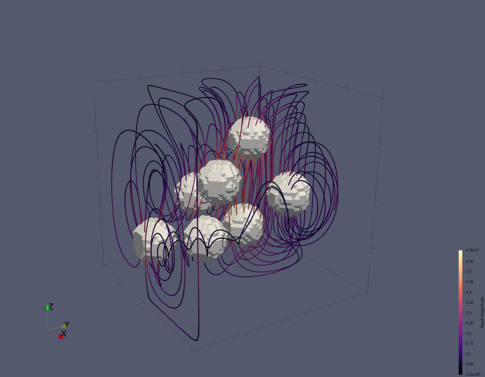

# JustRelax.jl


Need to solve a very large multi-physics problem on a GPU cluster? Just Relax!

Pseudo-transient accelerated iterative solvers, ready for extreme-scale, multi-GPU computation.

JustRelax.jl is a collection of pseudo-transient relaxation solvers
for multi-physics problems on regular, staggered, parallel grids,
using MPI and multiple CPU or GPU backends.
It relies on [ImplicitGlobalGrid.jl](https://github.com/omlins/ImplicitGlobalGrid.jl)
and [ParallelStencil.jl](https://github.com/omlins/ParallelStencil.jl).
It's part of the [PTSolvers project](https://ptsolvers.github.io) and
the [GPU4GEO project](https://www.pasc-ch.org/projects/2021-2024/gpu4geo/).

The package serves several purposes:

  * It reduces code duplication between several applications, e.g. [PseudoTransientStokes.jl](https://github.com/PTsolvers/PseudoTransientStokes.jl)
  and [PseudoTransientAdjoint.jl](https://github.com/PTsolvers/PseudoTransientAdjoint.jl)
  * It provides a collection of solvers to be used in quickly developing new applications
  * It provides some standardization so that application codes can

     - more easily "add more physics"
     - more easily switch between a psuedo-transient solver and another solver (e.g. a direct solve or a multigrid method)

  * It provides a natural place to describe performance benchmarks for the solver routines
  * It defines useful solvers to be encapsulated and used from non-Julia applications
  * It provides a natural location for contributions of new solvers for use by the larger community

We include several miniapps, each designed to solve a well-specified benchmark problem, in order to provide

  - examples of high-performance usage,
  - bases on which to build more full-featured application codes
  - cases for reference and performance tests
  - JustRelax.jl's entries in "bake offs"
  - tests and examples of interfaces with other packages applications might use, in particular
    - CompGrids.jl
    - PETSc.jl

JustRelax.jl is used in the following applications:

  * TODO link to all applications using the package here (crucial for early development)
  

# Installation
```Julia
] add JustRelax # or: import Pkg; Pkg.add("JustRelax")
```

# 3D example: multiple sinkers
## Setup
The model consists of $n$ high-viscosity and dense spherical inclusions suspended in a lower viscosity matrix within the domain $\Omega\in[0,L_x]\times[0,L_y]\times[0,L_z]$. Free-slip boundary conditions is prescribed in all the boundaries of the domain, and the flow is exclusively driven by buoyancy.
## Building the model
Apart from ``JustRelax.jl``, we rely on an [InclusionsGenerator.jl](https://github.com/albert-de-montserrat/InclusionsGenerator.jl) to generate random spheres inside a cubic domain and [MPI.jl](https://github.com/JuliaParallel/MPI.jl.git) for many-cores/GPUs computations.

```Julia
using JustRelax
using BallsGen
using MPI
```

We first need to setup our enviroment. For a 3D model on CPUs
```Julia
# setup environment (device, default precission, spatial dimension)
model = PS_Setup(:cpu, Float64, 3)
environment!(model)
```

Define some helper functions to map material phase properties onto the grid. More information about on `@parallel` and `@parallel_indices` can be found in [ParallelStencil.jl](https://github.com/omlins/ParallelStencil.jl).
```Julia
function insphere(x, y, z, c::NTuple{3,T}, r) where {T}
    return (x - c[1])^2 + (y - c[2])^2 + (z - c[3])^2 < r^2
end

@parallel_indices (i, j, k) function property2grid!(η, ηi, x, y, z, inclusion_centers, r)
    for c in inclusion_centers
        @inbounds if insphere(x[i], y[j], z[k], c, r)
            η[i, j, k] = ηi
        end
    end
    return nothing
end

function property2grid(
    ηm, ηi, ni, xi, inclusion_centers, r; b_width=(1, 1, 1)
)
    x, y, z = xi
    η = PTArray(fill(ηm, ni...))

    @parallel viscosity!(η, ηi, x, y, z, inclusion_centers, r)

    return η
end
```

Main function
```Julia
function Sinker(;
    nincl=7, # max. number of inclusions
    Δρ=2e0, # density contrast (denser inclusion(s))
    Δη=1e8, # viscosity contrast (Δη=η_matrix/Δη_inclusion)
    r=1, # inclusion radius
    nx=64, # grid points in x
    ny=64, # grid points in y
    nz=64, # grid points in z
    lx=1e1, # domain length
    ly=1e1, # domain length
    lz=1e1, # domain length
    init_MPI=MPI.Initialized() ? false : true,
    finalize_MPI=false,
)
    ## Spatial domain: This object represents a rectangular domain decomposed into a Cartesian product of cells
    # Here, we only explicitly store local sizes, but for some applications
    # concerned with strong scaling, it might make more sense to define global sizes,
    # independent of (MPI) parallelization
    ni = (nx, ny, nz) # number of nodes in x-, y- and z-
    igg = IGG(init_global_grid(nx, ny, nz; init_MPI=init_MPI)...) # init MPI
    @static if USE_GPU # select one GPU per MPI local rank (if >1 GPU per node)
        select_device()
    end
    li = (lx, ly, lz)  # domain length in x-, y- and z-
    di = @. li / (nx_g(), ny_g(), nz_g()) # grid step in x-, y- and z-
    max_li = max(li...)
    xci, xvi = lazy_grid(di, li) # nodes at the center and vertices of the cells

    ## (Physical) Time domain and discretization
    ttot = 1 # total simulation time
    dt = 1   # physical time step

    ## Allocate arrays needed for every Stokes problem
    # general stokes arrays
    stokes = StokesArrays(ni, ViscoElastic)
    # general numerical coeffs for PT stokes
    pt_stokes = PTStokesCoeffs(ni, di; Re=6π, CFL=0.8 / √3)

    ## Setup-specific parameters and fields
    ξ = 1.0 # Maxwell relaxation time
    ρm = 1e0 # matrix density
    ρi = Δρ # inclusion density
    ηm = 1.0 # matrix viscosity
    ηi = Δη # inclusion viscosity
    G = 1.0 # elastic shear modulus
    dt = ηm / (G * ξ) # dt = Inf to recover a purely viscous rheology

    ## Map spatially-variable physical parameters onto the grid
    # Viscosity
    ϕ = 0.05 # max. inclusion volume fraction (%)
    inclusion_centers, = 
        generate_inclusions(lx, ly, lz, ϕ, r; buffer_wall=1.5) # randomly located inclusions
    inclusion_centers = [
        inclusion_centers[i] for i in 1:min(length(inclusion_centers), nincl)
    ] # take max. nincl inclusions
    η = property2grid(ηm, ηi, ni, xvi, inclusion_centers, r) # map viscosity onto grid
    # Density
    ρ = property2grid(ρm, ρi, ni, xvi, inclusion_centers, r) # map density onto grid

    ## Body forces
    g = (0, 0, -1) # gravity
    ρg = ntuple(i -> @fill(g[i], ni...) .* ρ, Val(3))

    ## Boundary conditions 
    # There's no free surface, just free slip on all the boundaries
    freeslip = (freeslip_x=true, freeslip_y=true, freeslip_z=true)

    ## Time loop
    t = 0.0
    local iters
    while t < ttot
        iters = solve!(
            stokes,
            pt_stokes,
            ni,
            di,
            li,
            max_li,
            freeslip,
            ρg,
            η,
            G,
            dt,
            igg;
            iterMax=10_000, # max. numbers of PT iterations
            nout=500, # check residuals every nout PT iterations
            b_width=(1, 1, 1) 
        )
        t += dt
    end

    # finalize MPI
    finalize_global_grid(; finalize_MPI=finalize_MPI)

    return (ni=ni, xci=xci, xvi=xvi, li=li, di=di), stokes, iters
end

``` 

## Running the model
```Julia
geometry, stokes, iters = Sinker()
``` 

## Solution


## Running on GPUs

For the time being, `JustRelax.jl` supports running on (multiple) `CUDA` devices (`AMD` WIP). To run the model on GPU(s), simply:
```Julia
model = PS_Setup(:gpu, Float64, 3)
environment!(model)
```