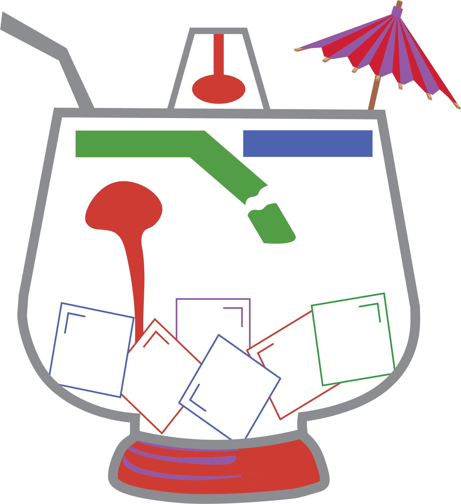

<h1> JustRelax.jl</h1>

[](https://ptsolvers.github.io/JustRelax.jl/dev/)
[](https://github.com/PTsolvers/JustRelax.jl/discussions/)
[](https://doi.org/10.5281/zenodo.10212422)
[](https://doi.org/10.21105/joss.09365)
[](https://github.com/PTsolvers/JustRelax.jl/actions/workflows/ci.yml)
[](https://buildkite.com/julialang/justrelax-dot-jl)
[](https://gitlab.com/cscs-ci/ci-testing/webhook-ci/mirrors/282716251344384/8101554320689785/-/pipelines)
[](https://codecov.io/gh/PTsolvers/JustRelax.jl)
[](https://opensource.org/licenses/MIT)
[](https://github.com/fredrikekre/Runic.jl)
[](http://juliapkgstats.com/pkg/JustRelax)
[](https://api.eu.badgr.io/public/assertions/gXEVz2XaS4iE-zi4lMY5pA "SQAaaS silver badge achieved")

<p align="center"></p>

> Need to solve a large multiphysics problem on many GPUs in parallel? Just Relax!

JustRelax.jl is a Julia package for geodynamic modeling with matrix-free, accelerated pseudo-transient solvers. It supports two- and three-dimensional applications on CPUs and GPUs, including distributed-memory runs with MPI.

The package is part of the [PTSolvers organisation](https://ptsolvers.github.io/) and was developed within the [GPU4GEO project](https://www.pasc.ch/projects/2021-2024/gpu4geo/). For an overview of the methods and examples, see the [documentation](https://ptsolvers.github.io/JustRelax.jl/dev/).

## Highlights

- Matrix-free iterative solvers for Stokes, thermal, and coupled geodynamic problems.
- CPU and GPU backends, with support for CUDA and AMDGPU through Julia’s package extensions.
- MPI-based domain decomposition via [ImplicitGlobalGrid.jl](https://github.com/omlins/ImplicitGlobalGrid.jl).
- Building blocks for material properties, particle methods, and constitutive models through [GeoParams.jl](https://github.com/JuliaGeodynamics/GeoParams.jl) and [JustPIC.jl](https://github.com/JuliaGeodynamics/JustPIC.jl).
- Reproducible benchmark and application examples in [`miniapps/`](miniapps).

JustRelax.jl builds on:

- [ParallelStencil.jl](https://github.com/omlins/ParallelStencil.jl)
- [ImplicitGlobalGrid.jl](https://github.com/omlins/ImplicitGlobalGrid.jl)
- [GeoParams.jl](https://github.com/JuliaGeodynamics/GeoParams.jl)
- [JustPIC.jl](https://github.com/JuliaGeodynamics/JustPIC.jl)

## Installation

JustRelax.jl is registered in the Julia General registry:

```julia
using Pkg
Pkg.add("JustRelax")
```

To use the latest development version instead:

```julia
using Pkg
Pkg.add(url = "https://github.com/PTsolvers/JustRelax.jl", rev = "main")
```

The package can be loaded with:

```julia
using JustRelax
```

See the [installation guide](https://ptsolvers.github.io/JustRelax.jl/dev/man/installation/) for backend-specific setup, including GPU and MPI environments.

## Testing

From the Julia package manager, run:

```julia
] test JustRelax
```

For local development, activate the repository and run the same command:

```julia
] activate .
] test
```

## Miniapps and examples

The [`miniapps/`](miniapps) directory contains small, focused examples and benchmark problems covering convection, thermal diffusion, Stokes flow, shear heating, subduction, and more. They are intended as starting points for application codes and as reference cases for performance experiments.

Most examples run on a single node. They can be extended to multiple nodes with [MPI.jl](https://github.com/JuliaParallel/MPI.jl) and [ImplicitGlobalGrid.jl](https://github.com/omlins/ImplicitGlobalGrid.jl). The documentation also includes guided examples for [Blankenbach convection](https://ptsolvers.github.io/JustRelax.jl/dev/man/Blankenbach/), [shear bands](https://ptsolvers.github.io/JustRelax.jl/dev/man/ShearBands/), and [2D subduction](https://ptsolvers.github.io/JustRelax.jl/dev/man/subduction2D/setup/).

## Contributing

Bug reports, documentation improvements, and new solver or benchmark contributions are welcome. Please open an [issue](https://github.com/PTsolvers/JustRelax.jl/issues) or start a [discussion](https://github.com/PTsolvers/JustRelax.jl/discussions/). See [CONTRIBUTING.md](CONTRIBUTING.md) for development guidelines.

## Citing

If you use JustRelax.jl, please cite the [software release on Zenodo](https://doi.org/10.5281/zenodo.18262030) and the [JOSS article](https://doi.org/10.21105/joss.09365). The repository also includes a [`CITATION.cff`](CITATION.cff) file for citation tools.

## Funding

Development has been supported by the [GPU4GEO and δGPU4GEO projects](https://gpu4geo.org/), the [PASC](https://www.pasc.ch/) project, and the European Research Council through the MAGMA project (ERC Consolidator Grant #771143).
