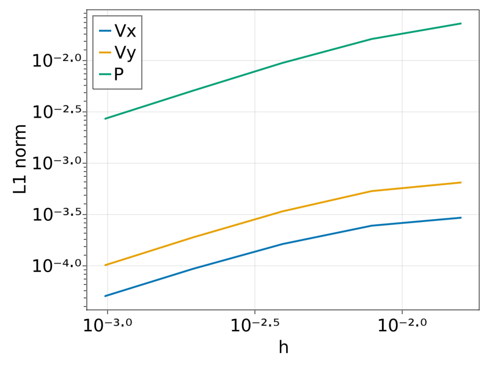

# JustRelax.jl

Need to solve a very large multi-physics problem on a GPU cluster? Just Relax!

Pseudo-transient accelerated iterative solvers, ready for extreme-scale, multi-GPU computation.

JustRelax.jl is a collection of pseudo-transient relaxation solvers
for multi-physics problems on regular, staggered, parallel grids,
using MPI and multiple CPU or GPU backends.
It relies on [ImplicitGlobalGrid.jl](https://github.com/omlins/ImplicitGlobalGrid.jl)
and [ParallelStencil.jl](https://github.com/omlins/ParallelStencil.jl).
It's part of the [PTSolvers project](https://ptsolvers.github.io) and
the [GPU4GEO project](https://www.pasc-ch.org/projects/2021-2024/gpu4geo/).

The package serves several purposes:

  * It reduces code duplication between several applications, e.g. [PseudoTransientStokes.jl](https://github.com/PTsolvers/PseudoTransientStokes.jl)
  and [PseudoTransientAdjoint.jl](https://github.com/PTsolvers/PseudoTransientAdjoint.jl)
  * It provides a collection of solvers to be used in quickly developing new applications
  * It provides some standardization so that application codes can

     - more easily "add more physics"
     - more easily switch between a psuedo-transient solver and another solver (e.g. a direct solve or a multigrid method)

  * It provides a natural place to describe performance benchmarks for the solver routines
  * It defines useful solvers to be encapsulated and used from non-Julia applications
  * It provides a natural location for contributions of new solvers for use by the larger community

We include several miniapps, each designed to solve a well-specified benchmark problem, in order to provide

  - examples of high-performance usage,
  - bases on which to build more full-featured application codes
  - cases for reference and performance tests
  - JustRelax.jl's entries in "bake offs"
  - tests and examples of interfaces with other packages applications might use, in particular
    - CompGrids.jl
    - PETSc.jl

JustRelax.jl is used in the following applications:

  * TODO link to all applications using the package here (crucial for early development)

## Stokes Benchmarks
# Benchmark 1: SolCx
Reference: Duretz, Thibault, et al. "Discretization errors and free surface stabilization
in the finite difference and marker‐in‐cell method for applied geodynamics: A numerical study.

$$\rho(x,y) = -\sin(\pi y)\cos(\pi x)$$
$$\eta(x) = \begin{cases}
  1    & 0 \leq x \leq 0.5 \\
  10^6 & 0.5 \le x \leq 1 
\end{cases}$$
(add code snippet)
(add solver convergence plot)

# Benchmark 2: SolKz
Reference: Duretz, Thibault, et al. "Discretization errors and free surface stabilization
in the finite difference and marker‐in‐cell method for applied geodynamics: A numerical study.

$$\rho(x,y) = -\sin(2y)\cos(3\pi x)$$
$$\eta(y) = \exp(\ln(6)y)$$
(add code snippet)
(add solver convergence plot)

# Benchmark 3: SolVi
