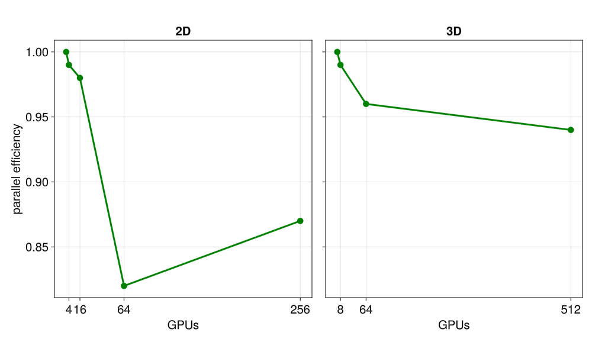

# Summary

JustRelax.jl is a high-performance Julia package for geodynamic modeling that implements matrix-free solvers based on the Accelerated Pseudo-Transient (APT) method. The package provides efficient and scalable solutions for simulating complex geophysical processes across multiple spatial and temporal scales, from crustal deformation to mantle dynamics. JustRelax.jl solves the coupled system of Stokes equations for compressible flow and heat diffusion equations with non-linear rheologies, enabling realistic simulations of Earth's lithosphere and mantle.

A key feature of JustRelax.jl is portability, being able to run on diverse operative systems (Windows, MacOS, and any Linux distro supported by the Julia programming language) computing architectures, including workstation-level CPUs, GPUs from multiple vendors, and High Performance Computing (HPC) clusters, without requiring code modifications and with a seamless installation. This portability is achieved through Julia's metaprogramming capabilities, which can automatically generate hardware-specific code at parse time. The matrix-free nature of the APT approach eliminates the need for expensive and not-so-scalable linear algebra operations, making it particularly suitable for large-scale simulations that are typically memory-bound on modern computing architectures.

The package implements a wide range of geological features essential for geodynamic modeling, including a complex and highly non-linear rheologies, a free-surface, and an efficient and scalable marker-in-cell methods for tracking and advecting material properties. JustRelax.jl is designed with a modular architecture that allows researchers to easily customize parts of the code such as rheological models, material models, or model setup generation without modifying the core package infrastructure, as these features are outsourced to other specialized packages. This flexibility, combined with Julia's interactive development environment, enables rapid prototyping and testing of new physical models while maintaining computational efficiency.

# Statement of Need

Computational geodynamics has become indispensable for investigating Earth's complex multi-scale, multi-physics processes. The field requires numerical methods that can efficiently solve the governing equations of momentum, mass, and energy conservation while handling large and extremely sharp material property contrasts, non-linear rheologies, and multi-phase interactions. Over the past decades, the geodynamics community has developed sophisticated modeling software tools that have substantially advanced our understanding of Earth's dynamics.

These codes have mainly based on staggered grid finite difference methods (e.g. **I3ELVIS** [@gerya2015plate], **StagYY** [@stagyy], **LaMEM** [@lamem]) or finite element methods (e.g. **CITCOM-S** [@citcom], **ASPECT** [@aspect], **pTatin3D** [@ptatin], **Underworld** [@underworld]). Despite their significant contributions, these existing geodynamic modeling frameworks face several critical challenges:

1) Most codes are optimized for CPUs and distributed memory architectures (classic CPU-based HPC clusters) and would require substantial modifications to full rewrites to be able to even run on hardware accelerators such as Graphical Process Units (GPUs). This CPU-only design creates barriers to adopting the latest high-performance computing resources, which are increasingly heterogeneous and evolving rapidly. Many existing solvers rely on direct or iterative matrix-based methods that encounter significant memory and performance bottlenecks when scaled to high-resolution 3D problems, particularly on memory-limited computing architectures like GPUs.

2) Traditional geodynamic codes are predominantly written (or at least their critical bits) in statically compiled languages like C/C++ or Fortran, with complex codebases that have evolved over decades. This complexity creates steep learning curves for new developers and makes implementing new physical models or numerical methods challenging without specialized knowledge of the entire codebase and a minimal level of programming skills. The static nature of these languages also limits the flexibility of code development workflows, which often involve rapid prototyping and interactive development in interpreted languages such as MATLAB or Python, instead of prototyping directly in the code base.

3) Often these codes heavily depend on external libraries to realise tasks such as linear algebra operations, parallelisationm, or I/O, for example. This reliance on external libraries can lead to compatibility issues, version conflicts, and difficulties in maintaining the codebase as dependencies evolve. Additionally, this often also results in not-so-straighforward installation experience, in particular for users without a lot of experience in software engineering.

JustRelax.jl intends to address these fundamental limitations through several innovative approaches. By leveraging Julia's metaprogramming capabilities, JustRelax.jl generates hardware-specific code at compile time. This allows the same high-level code to run efficiently across different architectures (CPUs, GPUs, and specialized accelerators) with minimal changes to the script to be run. The Accelerated Pseudo-Transient (APT) method [@Raess2022] implemented in JustRelax.jl is particularly well-suited for modern computing architectures, as it avoids the memory bottlenecks associated with traditional matrix-based solvers. This approach is inherently scalable and efficiently handles non-linearities without requiring solver modifications. Julia's rich ecosystem provides seamless access to tools for visualization, statistical analysis, machine learning, and automatic differentiation. This enables new scientific workflows such as adjoint-based inversions, uncertainty quantification, and parameter exploration that are challenging to implement with traditional geodynamic codes. The interactive nature of Julia allows researchers to rapidly prototype models, analyze results, and make adjustments within the same environment, significantly accelerating the research cycle in computational geodynamics while maintaining high performance through compiled code. Julia's accessibility and modern syntax lower the barrier for new contributors, while the modular architecture of JustRelax.jl enables domain scientists to extend functionality without having to learn and understand the entire codebase.

# Methods

JustRelax.jl implements robust numerical methods to solve the governing equations of geodynamics across different spatial and temporal scales. In this section, we describe the mathematical formulation of the core physical processes modeled by the package, the numerical algorithms used to solve these equations efficiently, and the implementation strategies that enable high performance on diverse computing architectures. We begin with the fundamental thermo-mechanical equations that govern lithospheric and mantle dynamics, followed by the pseudo-transient solver approach that forms the backbone of our matrix-free implementation. We then discuss the parallelization strategy and the advection schemes used to track material properties and deformation history.

## Thermo-mechanical modeling
Stokes equations for compressible flow are

$$
\begin{align}
    \nabla\cdot\mathbf{\tau} - \nabla p = \mathbf{f} \\
    \nabla\cdot\mathbf{v} + \beta \frac{\partial p}{\partial t} + \alpha \frac{\partial T}{\partial t} = 0
\end{align}
$$

where $\nabla$ is the nabla operator, $\mathbf{\tau}$ is the deviatoric stress tensor, $p$ is the pressure, $\mathbf{f}$ are the body forces, usually being the buoyancy forces $\mathbf{f} = \rho \mathbf{g}$ where $\rho$ is density and $\mathbf{g} = (0, -g_y)$ is the gravitational force vector, $\mathbf{v}$ is the velocity field, $\beta$ is the inverse of the bulk modulus, and $\alpha$ is the thermal expansivity coefficient. The previous system of equations is closed with the constitutive equation that relates the deviatoric strain tensor $\dot{\mathbf{\varepsilon}}$ with $\mathbf{\tau}$. In the simple case of a linear isotropic rheology, the constitutive equation is

$$
\begin{align}
    \mathbf{\tau} = 2\eta\dot{\mathbf{\varepsilon}}
\end{align}
$$

Material properties such as density and rheology laws representative of Earth's materials are temperature dependent, for which it is crucial to also model the evolution of the temperature field. The temporal evolution of the temperature $T$ is given by the equation of conservation of energy:

$$
\begin{align}
    \rho C_p \frac{\partial T}{\partial t} = - \nabla q + \mathbf{\tau}:\mathbf{\dot\varepsilon} + \alpha T (\mathbf{v} \cdot \nabla P) + Q \\
    q = - \kappa \nabla T
\end{align}
$$

where $C_p$ is the heat capacity, $\kappa$ is the heat conductivity, $\mathbf{\tau}:\mathbf{\dot\varepsilon}$ is the shear heating (heating generated by viscous dissipation), $\alpha T (\mathbf{v} \cdot \nabla P)$ is the adiabatic heating, and $Q$ is the sum of any other source terms.

### Pseudo-Transient formulation

The equations of conservation of momentum, conservation of mass, and conservation of energy are solved using the accelerated pseudo-transient (APT) iterative approach. This method consists of transforming the elliptic PDEs into damped wave equations by augmenting them with a damped pseudo-time derivative. Upon convergence, the pseudo-time derivative term should vanish (to machine precision), hence recovering the original PDE. We employ the APT method because it is embarrassingly parallel as it is matrix-free and requiring only explicit updates. Therefore it can deal with non-linearities without modifying the solver, and its numerical implementation is much simpler than other solution methods typically used to solve the Stokes equations. The APT formulation of the compressible Stokes equations and continuity equation is then:
$$
\begin{align}
    \widetilde{\rho}\frac{\partial \mathbf{v}}{\partial \psi} + \nabla\cdot\mathbf{\tau} - \nabla p = \mathbf{f}  \\
    \frac{1}{\widetilde{K}}\frac{\partial p}{\partial \psi} + \nabla\cdot\mathbf{v} = \beta \frac{\partial p}{\partial t} + \alpha \frac{\partial T}{\partial t} \\
    \frac{1}{2\widetilde{G}} \frac{\partial\mathbf{\tau}}{\partial\psi}+ \frac{1}{2G}\frac{D\mathbf{\tau}}{Dt} + \frac{\mathbf{\tau}}{2\eta} = \dot{\mathbf{\varepsilon}} \\
\end{align}
$$

where the wide tilde denotes the effective damping coefficients and $\psi$ is the pseudo-time step. These are defined as in [@Raess2022]:
$$
\begin{align}
    \widetilde{\rho} = Re\frac{\eta}{\widetilde{V}L}, \qquad
    \widetilde{G} = \frac{\widetilde{\rho} \widetilde{V}^2}{r+2}, \qquad
    \widetilde{K} = r \widetilde{G}
\end{align}
$$
and
$$
\begin{align}
    \widetilde{V} = \sqrt{ \frac{\widetilde{K} +2\widetilde{G}}{\widetilde{\rho}}}, \qquad
    r = \frac{\widetilde{K}}{\widetilde{G}}, \qquad
    Re = \frac{\widetilde{\rho}\widetilde{V}L}{\eta}
\end{align}
$$
where the P-wave $\widetilde{V} = V_p = \widetilde{C} \frac{\Delta x}{\Delta \tau}$ is the characteristic velocity scale, and $Re$ is the Reynolds number. We refer the reader to [@Raess2022] for further details on these damping coefficients. Similarly to the Stokes equations, the PT heat diffusion equation is given by:
$$
\begin{align}
    \widetilde{\rho}\frac{\partial T}{\partial \psi} + \rho C_p \frac{\partial T}{\partial t} = -\nabla q \\
    \widetilde{\theta}\frac{\partial q}{\partial \psi} + q  = -\kappa\nabla T \\
\end{align}
$$

where
$$
\begin{align}
  \widetilde{\rho} = R_e \frac{\kappa}{\widetilde{V} L}, \qquad
  \theta_r = \frac{L}{R_e \widetilde{V}}, \qquad
  Re = \pi + \sqrt{\pi^2 + \frac{\rho C_p}{\kappa}L^2}
\end{align}
$$

The APT equations are solved by discretizing the pseudo-time derivatives, either explicitly or implicitly, and iterating until the residual form of the equations is below a given tolerance. This means that the wave component of the equation has completely damped out and the pseudo-time derivative is (approximately) zero. In JustRelax.jl, the APT equations are discretized implicitly, as this yields better convergence rates.

### Advection

The advection equation in a decoupled manner using a Particle-in-Cell (PiC) method to advect the temperature, composition, or any other information carried by the particles. This method is particularly well-suited for this task because it can accurately handle the advection of these fields @dominguez2024, and it is extensively used to simulate global and regional scale geodynamic processes, e.g. StaggYY [@stagyy], LaMEM [@lamem], I3ELVIS [@i3elvis], ASPECT [@aspect], amongst others. This is implemented in the publically available [JustPIC.jl](https://github.com/JuliaGeodynamics/JustPIC.jl) package, where different time integrators and velocity interpolation schemes are available.

### Parallelization

The APT method in JustRelax.jl is parallelised in a hybrid shared-distributed memory architecture manner, i.e. multithreading combined with MPI for CPUs, and GPU-aware MPI for multi-GPU architectures. Parallelisation is implemented with two Julia packages:

- [ParallelStencil.jl](https://github.com/omlins/ParallelStencil.jl) handles the backend abstractation, allowing the user to write (shared memory) parallel kernels that seamlessly run on CPUs and GPUs (currently supported: CUDA, AMDGPU, and Mac M-series chips). It automatically generates Julia code based on Base.Threads.jl (Julia's native multi-threading library) and the third-party GPU libraries CUDA.jl (Nvidia GPUs) [@CUDA.jl], AMDGPU.jl (AMD GPUs), and Metal.jl (Mac M-series chips) depending on the device backend of choice of the end-user.

- [ImplicitGlobalGrid.jl](https://github.com/eth-cscs/ImplicitGlobalGrid.jl) handles MPI domain decomposition and communication, distributing the computational domain across multiple (CPU/GPU) nodes. MPI communication is handled at the lowest level by MPI.jl, the Julia wrapper of the Message Passing Interface (MPI) standard.

# Package summary

JustRelax.jl features:

- **High-performance matrix-free solver**: The package implements a matrix-free Accelerated Pseudo-Transient (APT) method for Stokes and heat diffusion problems that achieves excellent convergence rates even for complex non-linear problems. The APT method eliminates the need for computationally expensive linear algebra operations and direct solvers, significantly improving computational efficiency for large-scale simulations. The embarrassingly parallel nature of the APT method makes it an excellent solver to exploit hardware accelerators such as GPUs.

<figure>
    
    <figcaption>Figure 1: GPU weak scaling performance of JustRelax.jl in the two- and three-dimensional backends, demonstrating efficient parallelization and scalability for large-scale geodynamic simulations</figcaption>
</figure>


<!--  -->

<!-- *Figure 1: Weak scaling performance of JustRelax.jl on different hardware architectures, demonstrating efficient parallelization and scalability for large-scale geodynamic simulations.* -->

- **Portability**: JustRelax.jl is designed to run efficiently on multiple hardware architectures (multi-XPU), including CPUs, GPUs (CUDA and AMD), and on multi-node clusters.  This portability is achieved through Julia's advanced meta-programming capabilities, which generate the code for the specific target hardware during compile or parse time, allowing the same code to run across different computing platforms without modifications. This abstraction of the hardware backend is implemented in the ParallelStencil.jl package.

```julia
const isCUDA = true # or `false` to use the CPU backend
# conditional loading of CUDA.jl
@static if isCUDA
    using CUDA
end
# load JustRelax.jl and its 2D backend
using JustRelax, JustRelax.JustRelax2D
# define the `backend` variable that is passed to instantiate JustRelax.jl
# objects on the correct hardware backend.
# Options:
#     CPUBackend, CUDABackend, AMDGPUBackend
const backend = @static if isCUDA
    CUDABackend
else
    JustRelax.CPUBackend
end
```

- **Advanced non-linear rheology**: The package supports a comprehensive suite of geologically relevant rheological models, including visco-elastic, visco-elasto-plastic, and non-Newtonian temperature- and pressure-dependent constitutive laws. This allows for realistic simulation of complex Earth materials that are essential for accurately modeling geological processes at a wide range of scales. All the materaial physics calculation that are local to a single grid point are computed in the external package [GeoParams.jl](https://github.com/JuliaGeodynamics/GeoParams.jl).

- **Particles-in-cell method**: The package employs an efficient particles-in-cell approach for tracking material properties and deformation history. This method prevents numerical diffusion of compositional boundaries and allows for accurate representation of complex geological structures, rheological interfaces, and strain localization features.

- **Free-surface implementation**: JustRelax.jl provides robust algorithms for tracking the evolution of topography through a free-surface boundary condition, with options for both Lagrangian and Eulerian formulations. This feature is critical for modeling surface processes such as mountain building, rifting, and subduction, where the interaction between internal deformation and surface topography plays a fundamental role in the tectonic evolution.

- **Modular architecture**: JustRelax.jl is designed with a highly modular structure that separates physics, numerics, and visualization components. This architecture allows users to extend the code with custom rheological models, boundary conditions, or numerical schemes without having to modify the core solver infrastructure, facilitating both research flexibility and code maintenance. The comprehensive test suite ensures stability when extending functionality.

<!--  -->

<figure>
    
    <figcaption> Figure 2: Main Julia dependencies of JustRelax.jl. </figcaption>
</figure>

<!-- - **Distributed I/O support**: The package implements efficient parallel input/output operations for handling large datasets common in 3D geodynamic simulations. This includes parallel writing and reading of solution fields, checkpoint/restart capabilities, and compatibility with standard visualization formats (VTK) for scientific data analysis and post-processing. -->

- **Interactive development environment**: As a Julia package, JustRelax.jl takes full advantage of the language's dynamic nature, allowing for interactive sessions, real-time debugging, and rapid prototyping of new features. This significantly reduces the development cycle compared to traditional compiled languages commonly used in geodynamic modeling, while maintaining competitive performance through just-in-time compilation and type stability.

# Examples

And extensive set of benchmarks and model examples are stored in the repositoty of JustRelax.jl. More complex examples such as [2D subduction](https://ptsolvers.github.io/JustRelax.jl/dev/man/subduction2D/subduction2D)  or the raise of a [3D plume](https://ptsolvers.github.io/JustRelax.jl/dev/man/plume3D/plume3D) are described in the package documentation.


<figure>
    
    <figcaption> Figure 3: Model examples from the documentation: a) 2D subduction, and b) raising of a hot plume in 3D. </figcaption>
</figure>

# Acknowledgments


# References
