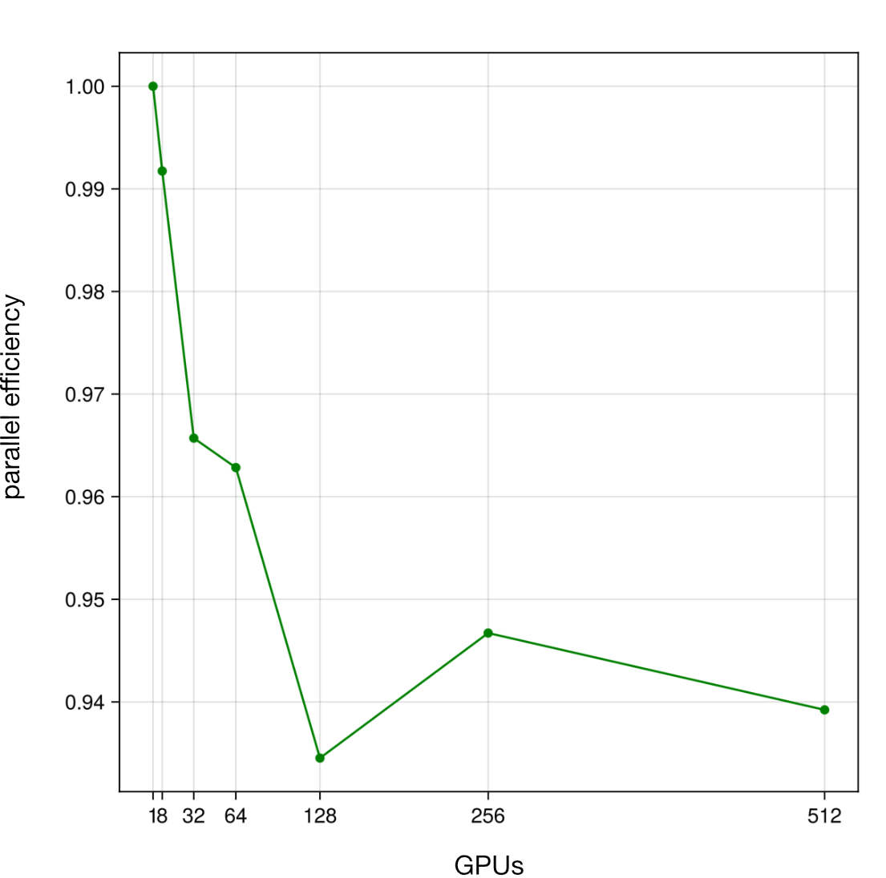
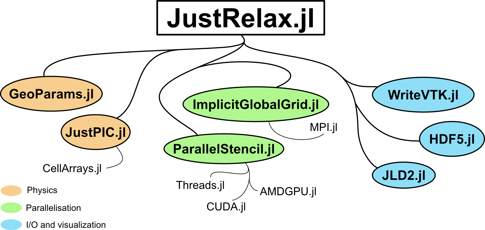

# Summary

JustRelax.jl is an open source, highly portable, and high-performance Julia package designed for geodynamic modeling. It employs the Accelerated Pseudo-Transient (APT) method to solve the Stokes and diffusion equations to simulate complex geodynamic processes. The APT is a matrix-free and embarrassingly parallel iterative method, making it especially well-suited to exploit Graphics Processing Unit (GPU) hardware accelerators available in distributed systems of most HPC centers.

JustRelax.jl incorporates a wide range of features critical to computational geodynamics. These include complex and highly non-linear rheologies, free surface and aits good spatial locality (compared to e.g. matrix-matrix or matrix-vector multiplication) particle-in-cell method to track and advect material phases and properties. Several of the features JustRelax.jl is built upon are outsourced to specialized packages. This modular design considerably reduces the size of the core code base, making the entire package infrastructure easier to maintain. This also improves code reusability, as the external packages can be re-used either as stand-alone packages or as building blocks for some other package.

Most of JustRelax.jl's core dependencies are fully written in the [Julia programming language](https://julialang.org/) [@bezanson2017julia], which facilitates contributions from users without extensive experience in programming, compared to other compiled languages common in HPC-focused software (C/C++/Fortran). The interactive environment of Julia allows users to prototype and implement new code in a single high-level language, improving the overall development experience in similar fashion to Python and MATLAB.

# Statement of Need

Computational geodynamics is an important tool for simulating and investigating Earth's complex multi-physics processes across different temporal and spatial scales. Running these simulations is computationally expensive which requires numerical methods that can efficiently solve the governing equations and resolving large and sharp contrasts in physical properties, and highly non-linear rheologies. In the past decades, the computational geodynamics community has developed an extensive set of software tools that have undoubtedly improved our understanding of Earth's dynamics. Most of these codes employ different implementations of either staggered grid finite difference methods (e.g. I3ELVIS [@gerya2015plate], StagYY [@stagyy], [LaMEM](https://github.com/UniMainzGeo/LaMEM/) [@lamem]) or finite element methods (e.g. [CITCOM-S](https://github.com/geodynamics/citcoms) [@citcom], [ASPECT](https://github.com/geodynamics/aspect) [@aspect], [pTatin3D](https://bitbucket.org/ptatin/ptatin3d/src/master/) [@ptatin], [Underworld](https://github.com/underworldcode/underworld2) [@underworld]) to solve the Stokes equations. Nonetheless, these existing geodynamic modeling tools face several critical challenges:

1) Most codes are optimized for CPUs and distributed (or hybrid shared-distributed) memory architectures (as in classic CPU-based HPC clusters) and would require substantial modifications to full rewrites to be able to execute on hardware accelerators such as GPUs and exploit the extra computational power. This CPU-only design limits the capability of these codes to take advantage of the latest high-performance computing resources, which are evolving rapidly towards multi-GPU systems. Beyond offloading parts of the computational routines onto GPUs, existing codes mostly build upon matrix-based solvers which may scale poorly on GPUs. It is likely that different solution strategies may need to be implemented in order to deliver better scaling on GPUs and accelerators.

2) Traditionally, geodynamic codes are written (or at least their critical bits) in statically compiled languages (to our knowledge, only C/C++ or Fortran), with complex codebases that have evolved over several years or decades. This leads to highly complex and very large codebases with a steep learning curve for new users and developers, in particular for students and those without significant experience in software engineering or even basic programming skills. The latter being the most common user in the geodynamics community. The static nature of these languages also limits the flexibility of code development workflows, which often involve rapid prototyping and interactive development in interpreted languages such as MATLAB or Python, instead of prototyping directly in the code base.

3) Moreover, existing codes depend on external libraries for performing performance critical operations such as linear algebra operations, or I/O, for example. This often leads to the so-called _dependencies hell_, where installation is not so trivial, in particular for newcomers, as compatibility issues, version conflicts, and other difficulties may occur.

With JustRelax.jl, we intend to address these fundamental limitations by introducing the first HPC-ready geodynamic software fully written in Julia:

- We leverage Julia's metaprogramming capabilities to generate hardware-specific code. With this, any script written by the user runs efficiently across different architectures and hardware with minimal changes.

- We use a solution method which is particularly well-suited for GPU accelerators.

- Julia's built-in package manager makes the installation of JustRelax.jl trivial, as it automatically downloads and installs all the required dependencies for any compatible operating system (Windows, macOs, and most of the mainstream Linux distributions).

- Julia is a higher-level language, with a syntax that may be familiar to Python and MATLAB users. This significantly facilitates contributions from users, while still offering a performance comparable to statically compiled languages.

# Methods

JustRelax.jl employs the APT method to solve the compressible Stokes and heat diffusion equations @rass2022. Within each APT iteration, the pressure-dependent equation of state, non-Newtonian viscosity, plastic stress corrections, and conservation of mass and momentum are solved simultaneously in a fully coupled manner. In the sections hereafter, we briefly summarize the governing equations and their respective APT implementation, and discuss the parallelization strategy and the advection schemes used to track material properties and deformation history.

## Thermo-mechanical modeling
The compressible Stokes equations are given by the conservation of momentum and mass equations, respectively:
$$
\begin{align}
    \nabla\cdot\mathbf{\tau} - \nabla p = \mathbf{f} \\
    \nabla\cdot\mathbf{v} = -\beta \frac{\partial p}{\partial t} + \alpha \frac{\partial T}{\partial t}
\end{align}
$$

where $\nabla$ is the nabla operator, $\mathbf{\tau}$ is the deviatoric stress tensor, $p$ is the total pressure, $\mathbf{f}$ are the body forces, usually being the buoyancy forces $\mathbf{f} = \rho \mathbf{g}$ where $\rho$ is density and $\mathbf{g}$ is the gravitational force vector, $\mathbf{v}$ is the velocity field, $\beta$ is the inverse of the bulk modulus, and $\alpha$ is the thermal expansivity coefficient. In the incompressible limit, the right-hand-side of the conservation of mass equation vanishes to zero ($\alpha=\beta=0$). The previous system of equations is closed with the constitutive equation that relates the deviatoric strain rate tensor $\dot{\mathbf{\varepsilon}}$ with $\mathbf{\tau}$. In computational geodynamics, we commonly consider composite non-linear visco-elasto-plastic rheologies, which can be expressed by the following constitutive equation:

$$
\begin{align}
  % \mathbf{\tau} = 2\eta\dot{\mathbf{\varepsilon}}
  \dot{\mathbf{\varepsilon}} = \frac{\mathbf{\tau}}{2\eta} + \frac{1}{2G} \frac{D\mathbf{\tau}}{Dt} + \dot\lambda\frac{\partial Q}{\partial \mathbf{\tau}}
\end{align}
$$

where $\eta$ is the viscosity, $G$ is the elastic shear modulus, $\dot\lambda$ is the plastic multiplier, and $Q$ is the plastic flow potential. Since the evolution of the temperature $T$ field is highly relevant in geodynamics, and most of the material properties such as density and flow laws are temperature dependent, we solve the energy conservation equation:

$$
\begin{align}
    \rho C_p \frac{\partial T}{\partial t} = - \nabla q + \mathbf{\tau}:(\mathbf{\dot\varepsilon} - \mathbf{\dot\varepsilon}^{\mathrm{el}}) + \alpha T (\mathbf{v} \cdot \nabla P) + Q \\
    q = - k \nabla T
\end{align}
$$

where $C_p$ is the heat capacity, $k$ is the heat conductivity, $\mathbf{\tau}:(\mathbf{\dot\varepsilon} - \mathbf{\dot\varepsilon}^{\mathrm{el}})$ is the shear heating (heating generated by viscous dissipation), $\mathbf{\dot\varepsilon}^{\mathrm{el}}$ is the elastic strain rate tensor, $\alpha T (\mathbf{v} \cdot \nabla P)$ is the adiabatic heating, and $Q$ is the sum of any other source terms.

### Pseudo-Transient formulation

The APT method consists of transforming the elliptic PDEs into damped wave equations by augmenting them with a second order pseudo-time derivative including a damping term. Upon convergence, all pseudo-time derivative vanish (up to machine precision), hence recovering the original PDE. We employ the APT method to take advantage of its good spatial locality (compared to e.g. matrix-matrix or matrix-vector multiplication), and its matrix-free nature that requires of explicit updates, which is ideal for embarrassingly parallel execution. This results in a much simpler numerical implementation than other solution methods typically used to solve the Stokes equations (Multigrid, Conjugate Gradients, GMRES...). The APT formulation of the compressible Stokes equations and continuity equation read:
$$
\begin{align}
    \widetilde{\rho}\frac{\partial \mathbf{v}}{\partial \psi} + \nabla\cdot\mathbf{\tau} - \nabla p = \mathbf{f}  \\
    \frac{1}{\widetilde{K}}\frac{\partial p}{\partial \psi} + \nabla\cdot\mathbf{v} = -\beta \frac{\partial p}{\partial t} + \alpha \frac{\partial T}{\partial t} \\
    \frac{1}{2\widetilde{G}} \frac{\partial\mathbf{\tau}}{\partial\psi} + \frac{\mathbf{\tau}}{2\eta} = \dot{\mathbf{\varepsilon}} \\
\end{align}
$$

where the wide tilde denotes the effective damping coefficients and $\psi$ is the pseudo-time step. These are defined as in [@Raess2022]:
$$
\begin{align}
    \widetilde{\rho} = Re\frac{\eta}{\widetilde{V}L}, \qquad
    \widetilde{G} = \frac{\widetilde{\rho} \widetilde{V}^2}{r+2}, \qquad
    \widetilde{K} = r \widetilde{G}
\end{align}
$$
with
$$
\begin{align}
    \widetilde{V} = \sqrt{ \frac{\widetilde{K} +2\widetilde{G}}{\widetilde{\rho}}}, \qquad
    r = \frac{\widetilde{K}}{\widetilde{G}}, \qquad
    Re = \frac{\widetilde{\rho}\widetilde{V}L}{\eta}
\end{align}
$$
where the P-wave $\widetilde{V} = V_p = \widetilde{C} \Delta x / \Delta \tau$ is the characteristic velocity scale, and $Re$ is the Reynolds number. We refer the reader to [@Raess2022] for further details on these damping coefficients. Similarly to the Stokes equations, the PT heat diffusion equation is given by:
$$
\begin{align}
    \widetilde{\rho}\frac{\partial T}{\partial \psi} + \rho C_p \frac{\partial T}{\partial t} = -\nabla q \\
    \widetilde{\theta}\frac{\partial q}{\partial \psi} + q  = -k\nabla T \\
\end{align}
$$

where
$$
\begin{align}
  \widetilde{\rho} = R_e \frac{k}{\widetilde{V} L}, \qquad
  \theta_r = \frac{L}{R_e \widetilde{V}}, \qquad
  Re = \pi + \sqrt{\pi^2 + \frac{\rho C_p}{k}L^2}
\end{align}
$$

The APT equations are solved by discretizing the pseudo-time derivatives, either explicitly or implicitly, and iterating until the residuals of the equations reach a defined tolerance. This means that the numerically introduced inertial terms have completely damped making the pseudo-time derivative to vanish. In JustRelax.jl, the APT equations are discretized implicitly, as this yields better convergence rates and improves numerical stability. It is also important to note that any non-linearity in the equations is treated at the same time as the pseudo-time derivative, significantly simplifying the implementation. This is in contrast to other methods that may require an additional inner iteration loop to solve non-linearities and the linearized equations separately.

### Advection

The advection equation is solved in a decoupled manner using a Particle-in-Cell (PiC) [@Harlow1965] method to advect the temperature, composition, or any other information carried by the particles. The PiC method is particularly well-suited for this task because it can accurately handle the advection of these fields, and it is extensively used to simulate global and regional scale geodynamic processes, e.g. StaggYY [@stagyy], LaMEM [@lamem], I3ELVIS [@i3elvis], ASPECT [@aspect], amongst others. PiC advection is implemented in the publicly available [JustPIC.jl](https://github.com/JuliaGeodynamics/JustPIC.jl) package, where different time integrators and velocity interpolation schemes are available.

### Parallelization

The APT method in JustRelax.jl is parallelised using a hybrid shared-distributed memory architecture fashion, i.e. multithreading combined with MPI for CPUs, and GPU-aware MPI for multi-GPU architectures. Parallelization is implemented with two Julia packages:

- [ParallelStencil.jl](https://github.com/omlins/ParallelStencil.jl) [@Omlin2024] handles the backend abstraction, allowing the user to write (shared memory) parallel kernels that seamlessly run on CPUs and GPUs (currently supported: CUDA, AMDGPU, and Mac M-series chips). It automatically generates Julia code based on Base.Threads.jl (Julia's native multi-threading library) and the third-party GPU libraries [CUDA.jl](https://github.com/JuliaGPU/CUDA.jl) (Nvidia GPUs) [@CUDA.jl], [AMDGPU.jl](https://github.com/JuliaGPU/AMDGPU.jl) (AMD GPUs), and [Metal.jl](https://github.com/JuliaGPU/Metal.jl) (Mac M-series chips) depending on the device backend of choice of the end-user.

- [ImplicitGlobalGrid.jl](https://github.com/eth-cscs/ImplicitGlobalGrid.jl) [@Omlin2024] handles Message Passing Interface (MPI) domain decomposition and communication, distributing the computational domain across multiple (CPU/GPU) compute nodes. MPI communication is handled at the lowest level by [MPI.jl](https://github.com/JuliaParallel/MPI.jl) [@MPI.jl], the Julia wrapper of the MPI standard.

# Package summary

JustRelax.jl features:

- **High-performance and scalable matrix-free solver**: The package implements a matrix-free APT method for (in)compressible Stokes and diffusion problems to circumvent the need for computationally expensive linear algebra operations and direct solvers, significantly improving computational efficiency for large-scale simulations. The embarrassingly parallel nature of the APT method makes it an excellent solver to exploit hardware accelerators such as GPUs. The weak scaling curve of the 3D Stokes solver is shown in Fig. \ref{fig:scaling}, where the parallel efficiency is the wall-time of any simulation normalized against the wall-time of a simulation with a single process.

{width=50%}

- **Portability**: JustRelax.jl is designed to run efficiently on multiple hardware architectures, including CPUs, GPUs (CUDA and AMD), and on multi-node clusters. This portability is achieved through Julia's advanced meta-programming capabilities, which generate the code for the specific target hardware during compile or parse time. This abstraction of the hardware backend is implemented in the ParallelStencil.jl package. In the code snippet below we show how one can switch the backend to be used by simply switching on or off the `isCUDA` flag, defined at the top-level or any given script:

```julia
const isCUDA = true # or `false` to use the CPU backend
# conditional loading of CUDA.jl
@static if isCUDA
    using CUDA
end
# load JustRelax.jl and its 2D backend
using JustRelax, JustRelax.JustRelax2D
# define the `backend` variable that is passed to instantiate JustRelax.jl
# objects on the correct hardware backend.
# Options:
#     CPUBackend, CUDABackend, AMDGPUBackend
const backend = @static if isCUDA
    CUDABackend
else
    JustRelax.CPUBackend
end
```

- **Advanced non-linear rheology**: The package supports a comprehensive suite of geologically relevant rheological models, including visco-elastic, visco-elasto-plastic, and non-Newtonian temperature- and pressure-dependent constitutive laws. This allows for simulations with complex Earth-like materials that are essential for modeling geological processes at a wide range of scales. All the material physics calculations that are local to a single grid point are computed in the external package [GeoParams.jl](https://github.com/JuliaGeodynamics/GeoParams.jl).

- **Particle-in-cell method**: The package employs an efficient particle-in-cell approach for tracking material properties and deformation history. This method prevents numerical diffusion of compositional boundaries and allows for accurate representation of complex geological structures, rheological interfaces, and strain localization features. This is implemented in [JustPIC.jl](https://github.com/JuliaGeodynamics/JustPIC.jl).

- **Free-surface implementation**: JustRelax.jl uses a variational Stokes [@larionov2017variational] approach to implement a free-surface boundary condition. This feature is critical for modeling surface processes such as mountain building, rifting, and subduction, where the interaction between internal deformation and surface topography plays a fundamental role in the tectonic evolution.

- **Modular architecture**: JustRelax.jl is designed with a highly modular design that separates physics, numerics, and I/O components. This architecture allows users to extend the code with, for example, custom rheological models, advection schemes, or I/O tools without having to modify the core solver infrastructure, facilitating both research flexibility and code maintenance. The core dependencies of JustRelax.jl are shown in Fig. \ref{fig:dependencies}.

<!-- <figure>
    
    <figcaption> Figure 2: Main Julia dependencies of JustRelax.jl. </figcaption>
</figure> -->

{width=60%}

<!-- - **Distributed I/O support**: The package implements efficient parallel input/output operations for handling large datasets common in 3D geodynamic simulations. This includes parallel writing and reading of solution fields, checkpoint/restart capabilities, and compatibility with standard visualization formats (VTK) for scientific data analysis and post-processing. -->

- **Interactive development environment**: As a Julia package, JustRelax.jl takes full advantage of the language's dynamic nature, allowing for interactive sessions, real-time debugging, and rapid prototyping. This significantly enhances the quality of life of the users and developers compared to traditional compiled languages, while maintaining high performance thanks to Julia's JIT/JAOT compilation.

- **Continuous integration (CI) and testing**: The package is continuously tested and validated against a suite of benchmarks and model examples to ensure correctness and performance. This includes unit tests, regression tests, and performance benchmarks on various hardware configurations. The CI/CD pipeline is implemented using GitHub Actions, which automatically runs tests on every commit and pull request. Additionally, we test the package on its GPU compatibility using Buildkite and the Swiss National Supercomputing Centre (CSCS) GPU cluster Alps.Daint. This ensures that the package remains robust and reliable across different hardware architectures and Julia versions.

# Examples

An extensive set of benchmarks and model examples are available in the GitHub repository of [JustRelax.jl](https://github.com/PTsolvers/JustRelax.jl). Some examples such as [shear band localization](https://ptsolvers.github.io/JustRelax.jl/dev/man/ShearBands), [2D subduction](https://ptsolvers.github.io/JustRelax.jl/dev/man/subduction2D/subduction2D) or the rise of a [3D plume](https://ptsolvers.github.io/JustRelax.jl/dev/man/plume3D/plume3D) are described in the [documentation](https://ptsolvers.github.io/JustRelax.jl/dev/). Here we limit ourselves to show some snapshots of the results of these examples in Fig. \ref{fig:examples}.


<!-- <figure>
    
    <figcaption> Figure 3: Model examples from the documentation: a) 2D subduction, and b) raising of a hot plume in 3D. </figcaption>
</figure> -->


# Acknowledgments
We acknowledge funding by the Swiss Platform for Advanced Scientific Computing (PASC) as part of the [GPU4GEO & $\partial$GPU4GEO](https://gpu4geo.org/) project, and the European Research Council through the MAGMA project, ERC Consolidator Grant #771143.

# References
