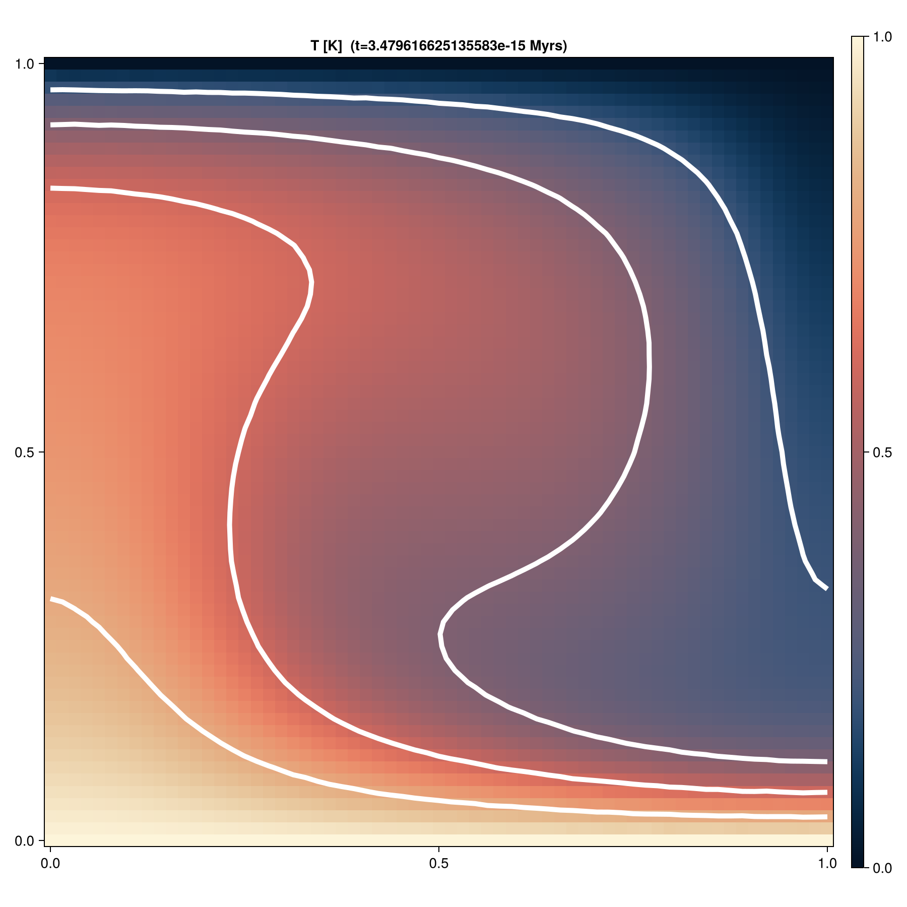
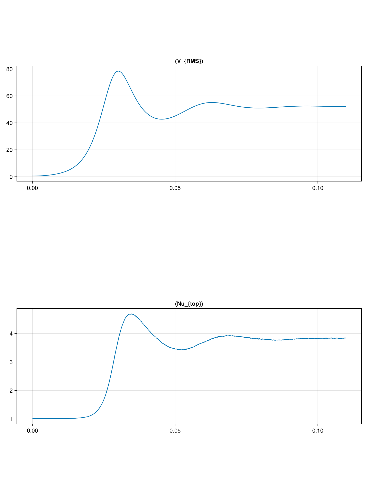

# Blankenbach benchmark

Thermal convection benchmark from  [Blankenbach et al., 1989](https://academic.oup.com/gji/article/98/1/23/622167)

## Initialize packages

Load `JustRelax.jl` necessary modules and define backend.
```julia
using JustRelax, JustRelax.JustRelax2D, JustRelax.DataIO
const backend_JR = CPUBackend
```

For this benchmark we will use particles to track the advection of the material phases and their information. For this, we will use [JustPIC.jl](https://github.com/JuliaGeodynamics/JustPIC.jl)
```julia
using JustPIC, JustPIC._2D
const backend = CPUBackend # Options: CPUBackend, CUDABackend, AMDGPUBackend
```

We will also use [ParallelStencil.jl](https://github.com/omlins/ParallelStencil.jl) to write some device-agnostic helper functions:
```julia
using ParallelStencil
@init_parallel_stencil(Threads, Float64, 2) #or (CUDA, Float64, 2) or (AMDGPU, Float64, 2)
```
and will use [GeoParams.jl](https://github.com/JuliaGeodynamics/GeoParams.jl/tree/main) to define and compute physical properties of the materials:
```julia
using GeoParams
```

## Script

### Model domain
```julia
nx = ny      = 51                       # number of cells per dimension
nit          = 6e3
igg          = IGG(
    init_global_grid(nx, ny, 1; init_MPI= true)...
)                                       # initialize MPI grid
ly           = 1.0                      # domain length in y
lx           = ly * ar                  # domain length in x
ni           = nx, ny                   # number of cells
li           = lx, ly                   # domain length in x- and y-
di           = @. li / ni               # grid step in x- and -y
origin       = 0.0, 0.0                 # origin coordinates
grid         = Geometry(ni, li; origin = origin)
(; xci, xvi) = grid                     # nodes at the center and vertices of the cells
dt = dt_diff = 0.9 * min(di...)^2 / 4.0 # diffusive CFL timestep limiter
```

### Rheology
```julia
rheology = (
    SetMaterialParams(;
        Phase             = 1,
        Density           = PT_Density(; ρ0 = 1, α = 1, β = 0.0),
        HeatCapacity      = ConstantHeatCapacity(; Cp = 1.0),
        Conductivity      = ConstantConductivity(;  k = 1.0),
        CompositeRheology = CompositeRheology((LinearViscous(; η = 1),)),
        RadioactiveHeat   = ConstantRadioactiveHeat(0.0),
        Gravity           = ConstantGravity(; g = 1e4),
    ),
)
```

### Initialize particles
```julia
nxcell              = 24 # initial number of perticles per cell
max_xcell           = 35 # maximum number of perticles per cell
min_xcell           = 12 # minimum number of perticles per cell
particles           = init_particles(
    backend, nxcell, max_xcell, min_xcell, xvi..., di..., ni...
) # particles object
subgrid_arrays      = SubgridDiffusionCellArrays(particles) # arrays needed for subgrid diffusion
# velocity grids
grid_vx, grid_vy    = velocity_grids(xci, xvi, di) # staggered velocity grids
```

and we want to keep track of the temperature `pT`, temperature of the previous time step `pT0`, and material phase `pPhase`:

```julia
pT, pT0, pPhases = init_cell_arrays(particles, Val(3))
particle_args    = (pT, pT0, pPhases)
```

### Temperature anomaly
```julia
xc_anomaly = 0.0     # origin of thermal anomaly
yc_anomaly = 1 / 3   # origin of thermal anomaly
r_anomaly  = 0.1 / 2 # radius of perturbation
```

Helper function to initialize material phases with [ParallelStencil.jl](https://github.com/omlins/ParallelStencil.jl)
```julia
function init_phases!(phases, particles)
    ni = size(phases)

    @parallel_indices (i, j) function init_phases!(phases, index)
        @inbounds for ip in JustRelax.cellaxes(phases)
            # quick escape if the ip-th element of the [i,j]-th cell is empty
            JustRelax.@cell(index[ip, i, j]) == 0 && continue
            # all particles have phase number = 1.0
            JustRelax.@cell phases[ip, i, j] = 1.0
        end
        return nothing
    end

    @parallel (@idx ni) init_phases!(phases, particles.index)
end

init_phases!(pPhases, particles, lx, yc_anomaly, r_anomaly)
```

or we can use the alternative one-liners
```julia
@views pPhase.data[!isnan.(particles.index.data)] .= 1.0
```
or
```julia
map!(x -> isnan(x) ? NaN : 1.0, pPhase.data, particles.index.data)
```

and finally we need the phase ratios at the cell centers:
```julia
phase_ratios = PhaseRatio(backend_JR, ni, length(rheology))
phase_ratios_center(phase_ratios, particles, grid, pPhases)
```

### Stokes and heat diffusion arrays

Stokes arrays object
```julia
stokes = StokesArrays(backend_JR, ni)
```

and the correspondent heat diffusion one
```julia
thermal = ThermalArrays(backend_JR, ni)
```

### Initialize thermal profile and viscosity fields

To initialize the thermal profile we use [ParallelStencil.jl](https://github.com/omlins/ParallelStencil.jl) again
```julia
@parallel_indices (i, j) function init_T!(T, y)
    T[i, j] = 1 - y[j]
    return nothing
end

@parallel (@idx size(thermal.T))  init_T!(thermal.T,  xvi[2]) # cell vertices
@parallel (@idx size(thermal.Tc)) init_T!(thermal.Tc, xci[2]) # cell centers
```

and we define a rectangular thermal anomaly at $x \in [0, 0.05]$, $y \in [\frac{1}{3} - 0.05, \frac{1}{3} + 0.05]$
```julia
function rectangular_perturbation!(T, xc, yc, r, xvi)
    @parallel_indices (i, j) function _rectangular_perturbation!(T, xc, yc, r, x, y)
        @inbounds if ((x[i]-xc)^2 ≤ r^2) && ((y[j] - yc)^2 ≤ r^2)
            T[i, j] += .2
        end
        return nothing
    end
    ni = size(T)
    @parallel (@idx ni) _rectangular_perturbation!(T, xc, yc, r, xvi...)
    return nothing
end

xc_anomaly  = 0.0    # center of the thermal anomaly
yc_anomaly  = 1/3    # center of the thermal anomaly
r_anomaly   = 0.1/2  # half-width of the thermal anomaly
rectangular_perturbation!(thermal.T, xc_anomaly, yc_anomaly, r_anomaly, xvi)
```

We initialize the buoyancy forces and viscosity
```julia
ρg               = @zeros(ni...), @zeros(ni...)
η                = @ones(ni...)
args             = (; T = thermal.Tc, P = stokes.P, dt = Inf)
compute_ρg!(ρg[2], phase_ratios, rheology, args)
compute_viscosity!(stokes, 1.0, phase_ratios, args, rheology, (-Inf, Inf))
```
where `(-Inf, Inf)` is the viscosity cutoff.

### Boundary conditions
```julia
flow_bcs      = VelocityBoundaryConditions(;
    free_slip = (left = true, right=true, top=true, bot=true),
)
thermal_bc    = TemperatureBoundaryConditions(;
    no_flux   = (left = true, right = true, top = false, bot = false),
)
thermal_bcs!(thermal, thermal_bc)
thermal.Told .= thermal.T
```

### Pseuo-transient coefficients
```julia
pt_stokes   = PTStokesCoeffs(li, di; ϵ=1e-4,  CFL = 1 / √2.1)
pt_thermal  = PTThermalCoeffs(
    backend_JR, rheology, phase_ratios, args, dt, ni, di, li; ϵ=1e-5, CFL = 1e-1 / √2.1
)
```

### Just before solving the problem...
We need to allocate some arrays to be able to do the subgrid diffusion of the temperature field at the particles level:
```julia
T_buffer    = @zeros(ni.+1)     # without the ghost nodes at the x-direction
Told_buffer = similar(T_buffer) # without the ghost nodes at the x-direction
dt₀         = similar(stokes.P) # subgrid diffusion time scale
# copy temperature to buffer arrays
for (dst, src) in zip((T_buffer, Told_buffer), (thermal.T, thermal.Told))
    copyinn_x!(dst, src)
end
# interpolate temperatyre on the particles
grid2particle!(pT, xvi, T_buffer, particles)
pT0.data    .= pT.data
```
where
```julia
function copyinn_x!(A, B)
    @parallel function f_x(A, B)
        @all(A) = @inn_x(B)
        return nothing
    end
    @parallel f_x(A, B)
end
```

In this benchmark we want to keep track of the time `trms`, the rms-velocity `Urms`

$$ U_{rms} = \sqrt{ \int_{\Omega} (V_x^2 + V_y^2 ) d\Omega} $$

and the Nusselt number at the top of the model `Nu_top`

$$ Nu_{top} = \int \frac{\partial T}{\partial x} dx $$

And we will store their time history in the vectors:
```julia
Urms   = Float64[]
Nu_top = Float64[]
trms   = Float64[]
```

We further need two buffer arrays where to interpolate the velocity field at the vertices of the grid cells
```julia
# Buffer arrays to compute velocity rms
Vx_v = @zeros(ni.+1...)
Vy_v = @zeros(ni.+1...)
```

### Advancing one time step

1. Solve stokes
```julia
solve!(
    stokes,
    pt_stokes,
    di,
    flow_bcs,
    ρg,
    phase_ratios,
    rheology,
    args,
    Inf,
    igg;
    kwargs = (;
        iterMax          = 150e3,
        nout             = 200,
        viscosity_cutoff = (-Inf, Inf),
        verbose          = true
    )
)
# calculate adaptive time step
dt = compute_dt(stokes, di, dt_diff)
```
2. Heat diffusion solver
```julia
heatdiffusion_PT!(
    thermal,
    pt_thermal,
    thermal_bc,
    rheology,
    args,
    dt,
    di;
    kwargs = (;
        igg     = igg,
        phase   = phase_ratios,
        iterMax = 10e3,
        nout    = 1e2,
        verbose = true,
    )
)
```
3. Subgrid diffusion at the particle level
```julia
for (dst, src) in zip((T_buffer, Told_buffer), (thermal.T, thermal.Told))
    copyinn_x!(dst, src)
end
subgrid_characteristic_time!(
    subgrid_arrays, particles, dt₀, phase_ratios, rheology, thermal, stokes, xci, di
)
centroid2particle!(subgrid_arrays.dt₀, xci, dt₀, particles)
subgrid_diffusion!(
    pT, T_buffer, thermal.ΔT[2:end-1, :], subgrid_arrays, particles, xvi,  di, dt
)
```
4. Advect particles
```julia
# advect particles in space
advection!(particles, RungeKutta2(), @velocity(stokes), (grid_vx, grid_vy), dt)
# advect particles in memory
move_particles!(particles, xvi, particle_args)
# check if we need to inject particles
inject_particles_phase!(particles, pPhases, (pT, ), (T_buffer, ), xvi)
# update phase ratios
phase_ratios_center(phase_ratios, particles, grid, pPhases)
```
5.  Interpolate `T` back to the grid
```julia
# interpolate fields from particle to grid vertices
particle2grid!(T_buffer, pT, xvi, particles)
@views T_buffer[:, end]      .= 0.0
@views T_buffer[:, 1]        .= 1.0
@views thermal.T[2:end-1, :] .= T_buffer
flow_bcs!(stokes, flow_bcs) # apply boundary conditions
temperature2center!(thermal)
```
6. Update buoyancy forces and viscosity
```julia
args = (; T = thermal.Tc, P = stokes.P,  dt=Inf)
compute_viscosity!(stokes, 1.0, phase_ratios, args, rheology, (-Inf, Inf))
compute_ρg!(ρg[2], phase_ratios, rheology, args)
```
7. Compute Nusselt number and rms-velocity
```julia
# Nusselt number, Nu = ∫ ∂T/∂z dx
Nu_it = sum( ((abs.(thermal.T[2:end-1,end] - thermal.T[2:end-1,end-1])) ./ di[2]) .*di[1])
push!(Nu_top, Nu_it)
# Compute U rms
# U₍ᵣₘₛ₎ = √ ∫∫ (vx²+vz²) dx dz
Urms_it = let
    JustRelax.JustRelax2D.velocity2vertex!(Vx_v, Vy_v, stokes.V.Vx, stokes.V.Vy; ghost_nodes=true)
    @. Vx_v .= hypot.(Vx_v, Vy_v) # we reuse Vx_v to store the velocity magnitude
    sqrt(sum( Vx_v.^2 .* prod(di)) )
end
push!(Urms, Urms_it)
push!(trms, t)
```

### Visualization
We will use `Makie.jl` to visualize the results
```julia
using GLMakie
```

### Fields
```julia
# Make particles plottable
p        = particles.coords
ppx, ppy = p
pxv      = ppx.data[:]
pyv      = ppy.data[:]
clr      = pT.data[:]
idxv     = particles.index.data[:];

# Make Makie figure
fig = Figure(size = (900, 900), title = "t = $t")
ax1 = Axis(fig[1,1], aspect = ar, title = "T [K]  (t=$(t/(1e6 * 3600 * 24 *365.25)) Myrs)")
ax2 = Axis(fig[2,1], aspect = ar, title = "Vy [m/s]")
ax3 = Axis(fig[1,3], aspect = ar, title = "Vx [m/s]")
ax4 = Axis(fig[2,3], aspect = ar, title = "T [K]")
# grid temperature
h1  = heatmap!(ax1, xvi[1], xvi[2], Array(thermal.T[2:end-1,:]) , colormap=:lajolla, colorrange=(0, 1) )
# y-velocity
h2  = heatmap!(ax2, xvi[1], xvi[2], Array(stokes.V.Vy) , colormap=:batlow)
# x-velocity
h3  = heatmap!(ax3, xvi[1], xvi[2], Array(stokes.V.Vx) , colormap=:batlow)
# particles temperature
h4  = scatter!(ax4, Array(pxv[idxv]), Array(pyv[idxv]), color=Array(clr[idxv]), colormap=:lajolla, colorrange=(0, 1), markersize=3)
hidexdecorations!(ax1)
hidexdecorations!(ax2)
hidexdecorations!(ax3)
Colorbar(fig[1,2], h1)
Colorbar(fig[2,2], h2)
Colorbar(fig[1,4], h3)
Colorbar(fig[2,4], h4)
linkaxes!(ax1, ax2, ax3, ax4)
save(joinpath(figdir, "$(it).png"), fig)
fig
```

### Final model
Temperature field


And time history of the rms-velocity and Nusselt number

