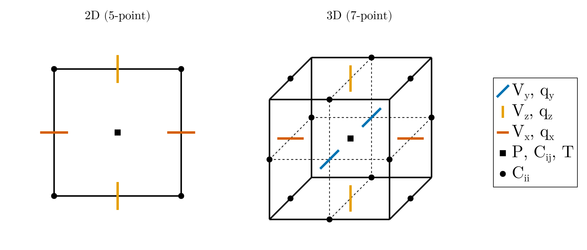

# Core objects

Every JustRelax model is built from the same handful of containers, allocated
once at the start of a script and threaded through the solver calls. This
page introduces them; the field-by-field listing lives in each type's own
docstring.

## StokesArrays

`StokesArrays` holds everything the Stokes solver reads and writes:
velocity (`V`), pressure (`P`), the deviatoric stress and strain-rate tensors
(`τ`, `ε`), viscosity (`viscosity`), the momentum/continuity residuals (`R`),
and, depending on the physics enabled, displacement (`U`), vorticity (`ω`),
and plastic strain accumulators (`ε_pl`, `EII_pl`).

```julia
stokes = StokesArrays(backend, ni)
```

`V`, `τ`, `ε`, and `viscosity` are themselves small structs (`Velocity`,
`SymmetricTensor`, `Viscosity`) rather than raw arrays, so a component is
always accessed by name:

```julia
stokes.V.Vx          # x-velocity, on cell faces
stokes.τ.xy           # shear stress, at vertices
stokes.viscosity.η   # viscosity at cell centers
stokes.P              # pressure at cell centers
```

## ThermalArrays

`ThermalArrays` is the heat-equation counterpart: temperature (`T`,
`Told`), the diffusive flux (`qTx`, `qTy`, `qTz`), the residual (`ResT`), and
source terms (`H`, `shear_heating`, `adiabatic`).

```julia
thermal = ThermalArrays(backend, ni)
thermal.T[i, j]      # temperature at cell centers, with ghost nodes
```

## Pseudo-transient damping coefficients

The Stokes and heat solvers are pseudo-transient (PT) iterative schemes; each
needs a set of damping coefficients derived from the grid and a target
Reynolds number. `PTStokesCoeffs` and `PTThermalCoeffs` compute these
once, from `li` and `di`, and are passed straight to `solve!`:

```julia
pt_stokes = PTStokesCoeffs(li, di; ϵ_rel = 1.0e-6, Re = 3π, CFL = 0.9 / √2.1)
```

An experimental alternative, `DYREL`, replaces the constant PT coefficients
with self-tuning ones and is instantiated from the viscosity field instead of
`li`/`di` alone — see [Using the APT method with auto tuned damping coefficients](@ref) for its own constructor and solver call.

## Phase ratios

Multi-phase models track, at every grid location, what fraction of each
material phase is present. `PhaseRatios` (from JustPIC.jl, re-exported here)
stores these fractions at cell centers, vertices, and the staggered velocity
nodes; `phase_ratios.center` and `phase_ratios.vertex` are what
`compute_viscosity!` and `compute_ρg!` read to blend per-phase material
properties.

## Staggered-grid field layout

All of the containers above share one staggered-grid convention: pressure,
temperature, and the diagonal stress/strain-rate components live at cell
centers; the off-diagonal (shear) components at cell vertices; and velocity
and flux components on the cell faces they cross.



This is also the layout `PhaseRatios` and the grid coordinates returned by
[`Geometry`](@ref) (`xci` vs. `xvi`) follow — see [Grid generation](@ref).
