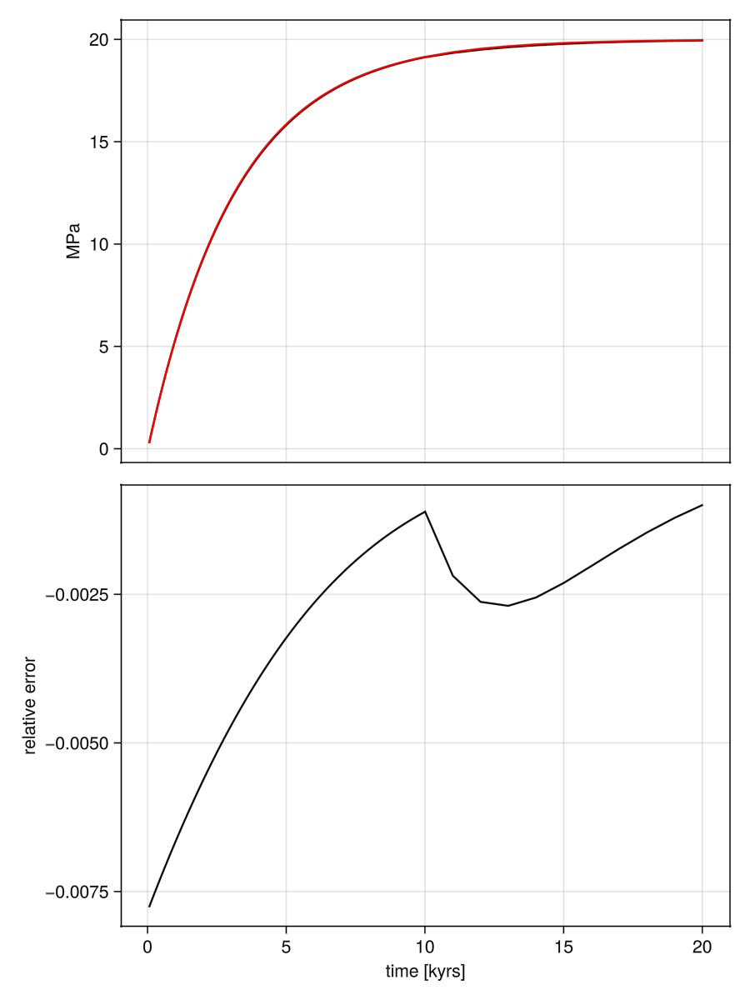

# Elastic build up
 
This benchmark is described in [Gerya and Yuen 2007](https://www.sciencedirect.com/science/article/pii/S0031920107000969), where the stress $\sigma_{ij}$ of an initally unloaded incompressible viscoelastic material is calculated subject to pure shear deformation is given by

$\sigma_{ij} = 2\dot\varepsilon_{ij}\eta\left(1-\exp(-\frac{Gt}{\eta}) \right)$

where $\dot\varepsilon_{ij}$ is the deviatoric strain tensor, $\eta$ is the viscosity, $G$ is the shear modulus, and $t$ is the time. The model is a 2D rectangle in Cartesian coordinates with dimensions $\Omega \in [0, L_x] \times [0, Ly]$ and a resolution of $n_x \times n_y$ cells. 

The material is subjected to a constant strain rate $\epsilon_{bg}$ at the top and bottom boundaries, and the left and right boundaries are free-slip. The material has a viscosity $\eta_0$, a shear modulus $G$, and a background strain rate $\epsilon_{bg}$. 

To run the benchmark we just need to include the benchmark script, which already loads `JustRelax`.

```julia
include("miniapps/benchmarks/stokes2D/elastic_buildup/Elastic_BuildUp.jl")
```

Then we need to specify the model resolution, dimensions, and parameters. For example:

```julia
# model specific parameters
nx, ny   = 32, 32       # number of cells in x and y
lx, ly   = 100e3, 100e3 # length of the domain in meters
endtime  = 10           # duration of the model in kyrs
η0       = 1e21         # viscosity
εbg      = 1e-14        # background strain rate (pure shear boundary conditions)
G        = 10e9         # shear modulus
```

and then we run the script:

```julia
_, _, av_τyy, sol_τyy, t, = elastic_buildup(;
    nx           = nx,
    ny           = ny,
    lx           = lx,
    ly           = ly,
    endtime      = endtime,
    η0           = η0,
    εbg          = εbg,
    G            = G,
    init_MPI     = JustRelax.MPI.Initialized() ? false : true,
    finalize_MPI = true,
);
```

Finally we can visualize the results with `GLMakie`:

```julia
using GLMakie
f   = Figure(size = (600,800))
ax1 = Axis(f[1, 1])
ax2 = Axis(f[2, 1])
lines!(ax1, t,  av_τyy ./ 1e6, color=:black)
lines!(ax1, t, sol_τyy ./ 1e6, color=:red)
lines!(ax2, t, (av_τyy.-sol_τyy) ./ sol_τyy, color=:black)

hidexdecorations!(ax1, 
    label = true, ticklabels = true, ticks = true, grid = false,minorgrid = false,minorticks = false
)

ax1.ylabel = "MPa"
ax2.ylabel = "relative error"
ax2.xlabel = "time [kyrs]"
```


