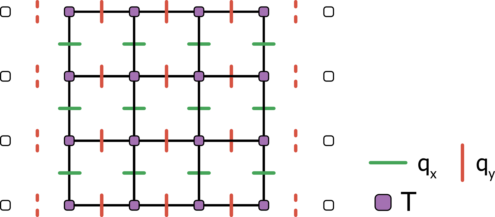
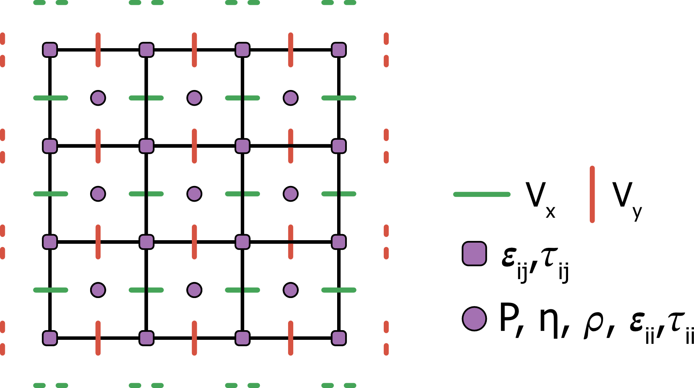

# Discretization of the APT equations

We discretize both the Stokes and heat diffusion equations using a Finite Differences approach on a staggered grid (ref Taras book here).

## Heat diffusion
The heat diffusion equation is discretized on a staggered grid as sketched below:

For simplicity we do not consider shear heating, adiabatic heating and source terms, and further consider the thermal conductivity as constant throughout the whole domain. The discretized 2D APT diffusion equation then yields:

$\begin{align}
\widetilde{\theta}\frac{q^{n+1}_{x_{ij}} - q^{n}_{x_{ij}}}{\Delta \psi} + q^{n+1}_{x_{ij}} = -\kappa\frac{T^n_{i+1j} + T^n_{ij}}{\Delta x} \\
\widetilde{\theta}\frac{q^{n+1}_{y_{ij}} - q^{n}_{y_{ij}}}{\Delta \psi} + q^{n+1}_{y_{ij}} = -\kappa\frac{T^n_{ij+1} + T^n_{ij}}{\Delta x} \\
\widetilde{\rho}\frac{T^{n+1}_{ij} + T^n_{ij}}{\Delta \psi} + \rho C_p \frac{ T^{n+1}_{ij} + T^t_{ij}}{\Delta t} = -\left(\frac{q_{x_{i+1j}} + q_{x_{ij}}}{\Delta x} + \frac{q_{y_{i+1j}} + q_{y_{ij}}}{\Delta y}\right) \\
\end{align}$

Upon convergence we recover

$\begin{align}
T^{t+\Delta t}_{ij}     = T^{n+1}_{ij}      \\
q^{t+\Delta t}_{x_{ij}} = q^{n+1}_{y_{ij}}  \\
q^{t+\Delta t}_{x_{ij}} = q^{n+1}_{y_{ij}}  \\
\end{align}$

## Stokes equations

The equations of conservation of mass and momentum are discretized on a staggered grid as sketched below:

where dotted lines represent the velocity ghost nodes.
<!-- $\begin{align}
\widetilde{\rho}\frac{\boldsymbol{u}}{\Delta\psi} + \nabla\cdot\boldsymbol{\tau} -
(\frac{p^{n+1} - p^{n+1}}{\Delta x} + \frac{p^{n+1} - p^{n+1}}{\Delta y}) =
\boldsymbol{f} \\
\end{align}$ -->

### Conservation of momentum

$\begin{align}
\widetilde{\rho}\frac{u^{n+1}_x - u^n_x}{\Delta\psi} + \nabla\cdot\boldsymbol{\tau} -
\frac{p^{n+1} - p^{n+1}}{\Delta x} =
0 \\
\end{align}$

$\begin{align}
\widetilde{\rho}\frac{u^{n+1}_y - u^n_y}{\Delta\psi} + \nabla\cdot\boldsymbol{\tau} -
\frac{p^{n+1} - p^{n+1}}{\Delta y} =
\rho g_y \\
\end{align}$

$\begin{align}
\frac{1}{\widetilde{K}}\frac{p^{n+1} - p^{n}}{\Delta\psi} +
\left(\frac{u^{n}_x - u^n_x}{\Delta x} + \frac{u^{n}_y - u^n_y}{\Delta y} \right) =
\frac{1}{\Delta t} \left( \beta (p^{t+\Delta t} - p^{t}) + \alpha (T^{t+\Delta t} - T^{t}) \right) \\
\end{align}$

### Conservation of mass

### Constitutive equation
