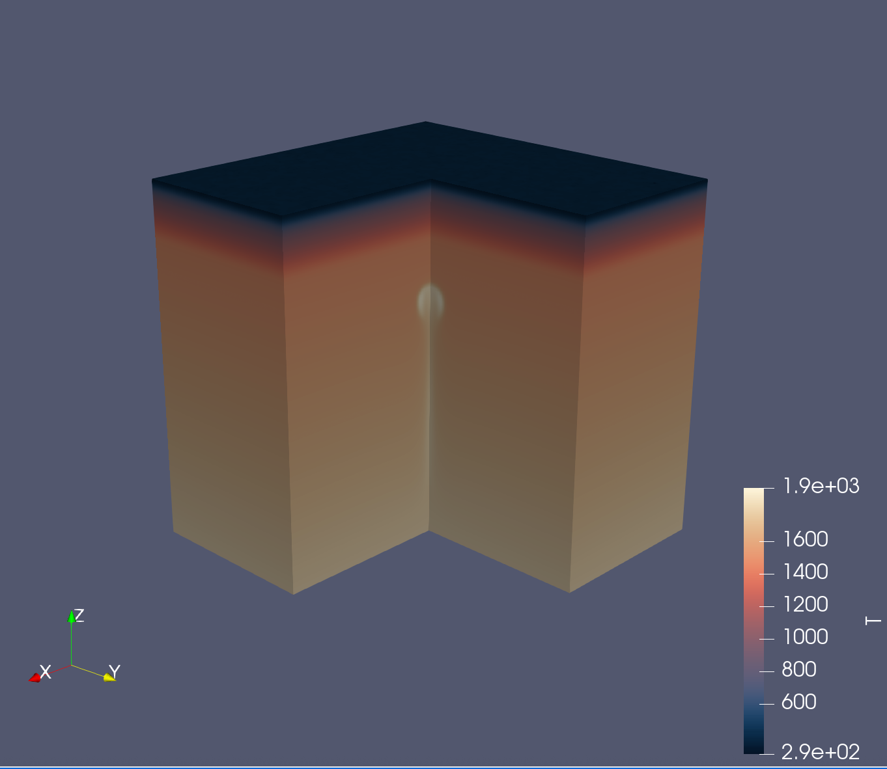

# 3D Plume 


# Initialize packages

Load JustRelax necessary modules and define backend. In this case we will use the CUDA backend, but you can also use the CPU or AMD GPU backends.
```julia
using CUDA # comment this out if you are not using CUDA; or load AMDGPU.jl if you are using an AMD GPU
using JustRelax, JustRelax.JustRelax3D, JustRelax.DataIO
const backend_JR = CUDABackend  # Options: CPUBackend, CUDABackend, AMDGPUBackend
```

For this benchmark we will use particles to track the advection of the material phases and their information. For this, we will use [JustPIC.jl](https://github.com/JuliaGeodynamics/JustPIC.jl)
```julia
using JustPIC, JustPIC._3D
const backend = CUDABackend # Options: JustPIC.CPUBackend, CUDABackend, JustPIC.AMDGPUBackend
```

We will also use [ParallelStencil.jl](https://github.com/omlins/ParallelStencil.jl) to write some device-agnostic helper functions:
```julia
using ParallelStencil
@init_parallel_stencil(CUDA, Float64, 3)
```

# Model setup


## Model domain
```julia
lz            = 700.0e3       # domain length in z
lx            = ly = lz       # domain length in x and y
ni            = nx, ny, nz    # number of cells
li            = lx, ly, lz    # domain length
di            = @. li / ni    # grid steps
origin        = 0.0, 0.0, -lz # origin coordinates (15km of sticky air layer)
grid          = Geometry(ni, li; origin = origin)
(; xci, xvi)  = grid          # nodes at the center and vertices of the cells
```

## Physical properties using GeoParams
For the rheology we will use the `rheology` object we created in the previous section.

## Initialize particles fields
```julia
nxcell         = 25
max_xcell      = 35
min_xcell      = 8
particles      = init_particles(backend, nxcell, max_xcell, min_xcell, xvi, di, ni)
subgrid_arrays = SubgridDiffusionCellArrays(particles)
# velocity staggered grids
grid_vxi       = velocity_grids(xci, xvi, di)
```

We would like to advect two fields stored at the particles, the temperature `pT`, and the material phases of each particle `pPhases`, which we initialize as `CellArray` objects:
```julia
pPhases, pT      = init_cell_arrays(particles, Val(2))
particle_args    = (pT, pPhases)
```

## Assign particles phases
```julia

function init_phases!(phases, particles, Lx, Ly; d = 650.0e3, r = 50.0e3)
    ni = size(phases)

    @parallel_indices (I...) function init_phases!(phases, px, py, pz, index, r, Lx, Ly)

        @inbounds for ip in cellaxes(phases)
            # quick escape
            @index(index[ip, I...]) == 0 && continue

            x = @index px[ip, I...]
            y = @index py[ip, I...]
            depth = -(@index pz[ip, I...])

            if 0.0e0 ≤ depth ≤ 21.0e3
                @index phases[ip, I...] = 1.0

            elseif 35.0e3 ≥ depth > 21.0e3
                @index phases[ip, I...] = 2.0

            elseif 90.0e3 ≥ depth > 35.0e3
                @index phases[ip, I...] = 3.0

            elseif depth > 90.0e3
                @index phases[ip, I...] = 4.0

            end

            # plume - rectangular
            if ((x - Lx * 0.5)^2 ≤ r^2) && ((y - Ly * 0.5)^2 ≤ r^2) && ((depth - d)^2 ≤ r^2)
                @index phases[ip, I...] = 5.0
            end
        end
        return nothing
    end

    return @parallel (@idx ni) init_phases!(phases, particles.coords..., particles.index, r, Lx, Ly)
end
```

```julia
xc_anomaly = lx / 2   # origin of thermal anomaly
yc_anomaly = ly / 2   # origin of thermal anomaly
zc_anomaly = -610.0e3 # origin of thermal anomaly
r_anomaly  = 50.0e3   # radius of perturbation
init_phases!(pPhases, particles, lx, ly; d = abs(zc_anomaly), r = r_anomaly)
phase_ratios = PhaseRatios(backend, length(rheology), ni)
update_phase_ratios!(phase_ratios, particles, xci, xvi, pPhases)
```

## Define temperature profile
```julia
thermal     = ThermalArrays(backend, ni)
thermal_bc  = TemperatureBoundaryConditions(;
    no_flux = (left = true, right = true, top = false, bot = false, front = true, back = true),
)
thermal_bcs!(thermal, thermal_bc)
```

```julia
@parallel_indices (I...) function init_T!(T, z)
    depth = -z[I[end]]

    if depth < 0.0
        T[I...] = 273.0

    elseif 0.0 ≤ (depth) < 35e3
        dTdZ = (923 - 273) / 35e3
        offset = 273
        T[I...] = (depth) * dTdZ + offset

    elseif 110e3 > (depth) ≥ 35e3
        dTdZ = (1492 - 923) / 75e3
        offset = 923
        T[I...] = (depth - 35e3) * dTdZ + offset

    elseif (depth) ≥ 110e3
        dTdZ = (1837 - 1492) / 590e3
        offset = 1492
        T[I...] = (depth - 110e3) * dTdZ + offset

    end

    return nothing
end
```

```julia
# Thermal rectangular perturbation
function rectangular_perturbation!(T, xc, yc, zc, r, xvi)

    @parallel_indices (i, j, k) function _rectangular_perturbation!(T, xc, yc, zc, r, x, y, z)
        @inbounds if (abs(x[i] - xc) ≤ r) && (abs(y[j] - yc) ≤ r) && (abs(z[k] - zc) ≤ r)
            depth = abs(z[k])
            dTdZ = (2047 - 2017) / 50.0e3
            offset = 2017
            T[i, j, k] = (depth - 585.0e3) * dTdZ + offset
        end
        return nothing
    end

    return @parallel _rectangular_perturbation!(T, xc, yc, zc, r, xvi...)
end
```

```julia
thermal    = ThermalArrays(backend_JR, ni)

# initialize thermal profile - Half space cooling
@parallel init_T!(thermal.T, xvi[3])
rectangular_perturbation!(thermal.T, xc_anomaly, yc_anomaly, zc_anomaly, r_anomaly, xvi)
```

```julia
thermal_bc = TemperatureBoundaryConditions(;
    no_flux = (left = true, right = true, top = false, bot = false, front = true, back = true),
)
thermal_bcs!(thermal, thermal_bc)
temperature2center!(thermal)
```

## Instantiate Stokes arrays
Stokes arrays object
```julia
stokes    = StokesArrays(backend, ni)
pt_stokes = PTStokesCoeffs(li, di; ϵ_rel=1e-4, Re=3π, r=1e0, CFL = 0.98 / √3)
```

## Initialize buoyancy forces and lithostatic pressure
```julia
ρg        = ntuple(_ -> @zeros(ni...), Val(3))
compute_ρg!(ρg[end], phase_ratios, rheology, (T=thermal.Tc, P=stokes.P))
stokes.P .= PTArray(backend)(reverse(cumsum(reverse((ρg[end]).* di[end], dims=3), dims=3), dims=3))
```

## Define boundary conditions
We we will use free slip boundary conditions on all sides
```julia
# Boundary conditions
flow_bcs = VelocityBoundaryConditions(;
    free_slip = (left = true, right = true, top = true, bot = true, front = true, back = true),
    no_slip = (left = false, right = false, top = false, bot = false, front = false, back = false),
)
flow_bcs!(stokes, flow_bcs) # apply boundary conditions
```

## Pseuo-transient coefficients
```julia
pt_thermal = PTThermalCoeffs(
    backend, rheology, phase_ratios, args0, dt, ni, di, li; ϵ=1e-5, CFL=0.98 / √3
)
```

## Just before solving the problem...
```julia
dt₀         = similar(stokes.P)
grid2particle!(pT, xvi, T_buffer, particles)
```

# Solving the problem
We will now advance the model in time, solving the Stokes and thermal equations, and advecting the particles.

## Advancing one time step

1. Interpolate fields from particle to grid vertices
```julia
particle2grid!(T_buffer, pT, xvi, particles)
temperature2center!(thermal)
```
2. Solve stokes
```julia
 t_stokes = @elapsed begin
    out = solve!(
        stokes,
        pt_stokes,
        di,
        flow_bcs,
        ρg,
        phase_ratios,
        rheology,
        args,
        Inf,
        igg;
        kwargs = (;
            iterMax = 100.0e3,
            nout = 1.0e3,
            viscosity_cutoff = (1e18, 1e24),
        )
    );
end
println("Stokes solver time             ")
println("   Total time:      $t_stokes s")
println("   Time/iteration:  $(t_stokes / out.iter) s")
```
3. Update time step
```julia
dt = compute_dt(stokes, di) * 0.8
```

4. Thermal solver and subgrid diffusion
```julia
heatdiffusion_PT!(
    thermal,
    pt_thermal,
    thermal_bc,
    rheology,
    args,
    dt,
    di;
    kwargs = (
        igg     = igg,
        phase   = phase_ratios,
        iterMax = 50e3,
        nout    = 1e2,
        verbose = true,
    )
)
# Subgrid diffusion
subgrid_characteristic_time!(
    subgrid_arrays, particles, dt₀, phase_ratios, rheology, thermal, stokes, xci, di
)
centroid2particle!(subgrid_arrays.dt₀, xci, dt₀, particles)
subgrid_diffusion!(
    pT, thermal.T, thermal.ΔT, subgrid_arrays, particles, xvi,  di, dt
)
```

5. Particles advection
```julia
# advect particles in space
advection!(particles, RungeKutta2(), @velocity(stokes), grid_vxi, dt)
# advect particles in memory
move_particles!(particles, xvi, particle_args)
# check if we need to inject particles
inject_particles_phase!(particles, pPhases, (pT, ), (thermal.T, ), xvi)
# update phase ratios
update_phase_ratios!(phase_ratios, particles, xci, xvi, pPhases)
```

6. **Optional:** Save data as VTK to visualize it later with [ParaView](https://www.paraview.org/)
```julia
Vx_v = @zeros(ni.+1...)
Vy_v = @zeros(ni.+1...)
Vz_v = @zeros(ni.+1...)
velocity2vertex!(Vx_v, Vy_v, Vz_v, @velocity(stokes)...)
data_v = (;
    T = Array(thermal.T),
)
data_c = (;
    Tc = Array(thermal.Tc),
    P = Array(stokes.P),
    η = Array(log10.(stokes.viscosity.η_vep)),
)
velocity_v = (
    Array(Vx_v),
    Array(Vy_v),
    Array(Vz_v),
)
save_vtk(
    joinpath(vtk_dir, "vtk_" * lpad("$it", 6, "0")),
    xvi,
    xci,
    data_v,
    data_c,
    velocity_v,
    t = t
)
```

### Model snapshot

