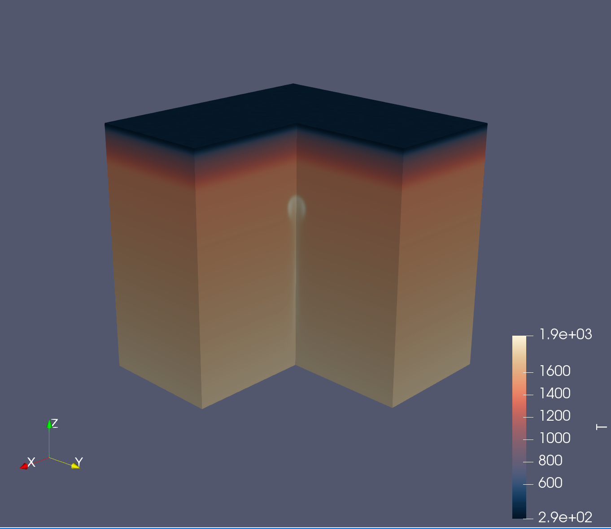

# 3D Plume

A thermal plume rising through a layered lithosphere. The complete, runnable script is at [`miniapps/convection/Plume3D/Plume3D.jl`](https://github.com/PTsolvers/JustRelax.jl/blob/main/miniapps/convection/Plume3D/Plume3D.jl); the sections below walk through it.

# Initialize packages

Load JustRelax and define the backend. Set `isCUDA = true` to run on a CUDA GPU, or load AMDGPU.jl and use `AMDGPUBackend` for an AMD GPU.
```julia
const isCUDA = false

@static if isCUDA
    using CUDA
end

using JustRelax, JustRelax.JustRelax3D, JustRelax.DataIO
using Pkg; Pkg.activate("miniapps")

const backend_JR = @static if isCUDA
    CUDABackend  # Options: CPUBackend, CUDABackend, AMDGPUBackend
else
    JustRelax.CPUBackend
end
```

We will also use [ParallelStencil.jl](https://github.com/omlins/ParallelStencil.jl) to write some device-agnostic helper functions:
```julia
using ParallelStencil, ParallelStencil.FiniteDifferences3D

@static if isCUDA
    @init_parallel_stencil(CUDA, Float64, 3)
else
    @init_parallel_stencil(Threads, Float64, 3)
end
```

Particles track the advection of the material phases and their information. For this we use [JustPIC.jl](https://github.com/JuliaGeodynamics/JustPIC.jl), which needs its own backend:
```julia
using JustPIC, JustPIC._3D

const backend_JP = @static if isCUDA
    CUDABackend  # Options: JustPIC.CPUBackend, CUDABackend, JustPIC.AMDGPUBackend
else
    JustPIC.CPUBackend
end

using GeoParams, CairoMakie, Printf
```

# Model setup

## Model domain
```julia
nx = ny = nz = 32             # number of cells per direction
lz           = 700.0e3        # domain length in z
lx           = ly = lz        # domain length in x and y
ni           = nx, ny, nz     # number of cells
li           = lx, ly, lz     # domain length
di           = @. li / ni     # grid steps
origin       = 0.0, 0.0, -lz  # origin coordinates
grid         = Geometry(ni, li; origin = origin)
(; xci, xvi) = grid           # nodes at the center and vertices of the cells
```

## Physical properties using GeoParams
For the rheology we will use the `rheology` object we created in the previous section. Its thermal properties also set the diffusive limit on the time step:
```julia
κ  = 10 / (rheology[1].HeatCapacity[1].Cp * rheology[1].Density[1].ρ0)
dt = dt_diff = 0.5 * min(di...)^3 / κ / 3.01 # diffusive CFL timestep limiter
```

## Initialize particles fields
```julia
nxcell, max_xcell, min_xcell = 25, 35, 8
particles      = init_particles(backend_JP, nxcell, max_xcell, min_xcell, grid.xi_vel...)
subgrid_arrays = SubgridDiffusionCellArrays(particles; loc = :center)
```

`loc = :center` because the resolved temperature field of `ThermalArrays` lives at the cell centers.

We would like to advect two fields stored at the particles, the temperature `pT`, and the material phases of each particle `pPhases`, which we initialize as `CellArray` objects:
```julia
pT, pPhases   = init_cell_arrays(particles, Val(2))
particle_args = (pT, pPhases)
```

## Assign particles phases
The lithosphere is layered by depth, and a cubic plume of half-width `r` is placed at depth `d`:
```julia
function init_phases!(phases, particles, Lx, Ly; d = 650.0e3, r = 50.0e3)
    ni = size(phases)

    @parallel_indices (I...) function _init_phases!(phases, px, py, pz, index, r, d, Lx, Ly)
        for ip in cellaxes(phases)
            # quick escape
            @index(index[ip, I...]) == 0 && continue

            x = @index px[ip, I...]
            y = @index py[ip, I...]
            depth = -(@index pz[ip, I...])

            if 0.0e0 ≤ depth ≤ 21.0e3
                @index phases[ip, I...] = 1.0

            elseif 35.0e3 ≥ depth > 21.0e3
                @index phases[ip, I...] = 2.0

            elseif 90.0e3 ≥ depth > 35.0e3
                @index phases[ip, I...] = 3.0

            elseif depth > 90.0e3
                @index phases[ip, I...] = 4.0

            end

            # plume - rectangular
            if ((x - Lx * 0.5)^2 ≤ r^2) && ((y - Ly * 0.5)^2 ≤ r^2) && ((depth - d)^2 ≤ r^2)
                @index phases[ip, I...] = 5.0
            end
        end
        return nothing
    end

    return @parallel (@idx ni) _init_phases!(phases, particles.coords..., particles.index, r, d, Lx, Ly)
end
```

```julia
xc_anomaly = lx / 2   # origin of thermal anomaly
yc_anomaly = ly / 2   # origin of thermal anomaly
zc_anomaly = -610.0e3 # origin of thermal anomaly
r_anomaly  = 50.0e3   # radius of perturbation
init_phases!(pPhases, particles, lx, ly; d = abs(zc_anomaly), r = r_anomaly)
phase_ratios = PhaseRatios(backend_JP, length(rheology), ni)
update_phase_ratios!(phase_ratios, particles, pPhases)
```

## Instantiate Stokes arrays
Instantiate the Stokes object with the `PTStokesCoeffs` defining the necessary pseudo transient variables including the relative $\epsilon_{rel}$ and the absolute tolerance $\epsilon_{abs}$

```julia
stokes    = StokesArrays(backend_JR, ni)
pt_stokes = PTStokesCoeffs(li, di; ϵ_abs = 1.0e-4, ϵ_rel = 1.0e-4, Re = 3π, r = 1.0e0, CFL = 0.9 / √3.1)
```

## Define temperature profile
The geotherm is piecewise linear in depth:
```julia
@parallel_indices (I...) function init_T!(T, z)
    depth = -z[I[3]]

    if depth < 0.0e0
        T[I...] = 273.0

    elseif 0.0e0 ≤ depth < 35.0e3
        dTdZ = (923 - 273) / 35.0e3
        offset = 273.0e0
        T[I...] = depth * dTdZ + offset

    elseif 110.0e3 > depth ≥ 35.0e3
        dTdZ = (1492 - 923) / 75.0e3
        offset = 923.0e0
        T[I...] = (depth - 35.0e3) * dTdZ + offset

    elseif depth ≥ 110.0e3
        dTdZ = (1837 - 1492) / 590.0e3
        offset = 1492.0e0
        T[I...] = (depth - 110.0e3) * dTdZ + offset

    end

    return nothing
end
```

on top of which we superimpose a hotter rectangular anomaly co-located with the plume:
```julia
# Thermal rectangular perturbation
function rectangular_perturbation!(T, xc, yc, zc, r, xvi)

    @parallel_indices (i, j, k) function _rectangular_perturbation!(T, xc, yc, zc, r, x, y, z)
        if (abs(x[i] - xc) ≤ r) && (abs(y[j] - yc) ≤ r) && (abs(z[k] - zc) ≤ r)
            depth = abs(z[k])
            dTdZ = (2047 - 2017) / 50.0e3
            offset = 2017
            T[i, j, k] = (depth - 585.0e3) * dTdZ + offset
        end
        return nothing
    end

    return @parallel _rectangular_perturbation!(T, xc, yc, zc, r, xvi...)
end
```

`thermal.T` is a cell-centered field surrounded by one ring of ghost nodes, so the profile is built on the vertices and then transferred to the centers with `vertex2center!`:
```julia
thermal    = ThermalArrays(backend_JR, ni)
thermal_bc = TemperatureBoundaryConditions(;
    no_flux = (left = true, right = true, top = false, bot = false, front = true, back = true),
)

T_vertex = @zeros(ni .+ 1...)
@parallel (@idx ni .+ 1) init_T!(T_vertex, xvi[3])
rectangular_perturbation!(T_vertex, xc_anomaly, yc_anomaly, zc_anomaly, r_anomaly, xvi)
vertex2center!(thermal.T, T_vertex; ghost_x = true, ghost_y = true, ghost_z = true)
thermal_bcs!(thermal, thermal_bc)
```

## Initialize buoyancy forces and lithostatic pressure
```julia
ρg = ntuple(_ -> @zeros(ni...), Val(3))
compute_ρg!(ρg[end], phase_ratios, rheology, (T = thermal.T, P = stokes.P))
compute_lithostatic_pressure!(stokes.P, ρg[end], di[end])
```

## Initialize viscosity
```julia
args             = (; T = thermal.T, P = stokes.P, dt = Inf)
viscosity_cutoff = (1.0e18, 1.0e24)
compute_viscosity!(stokes, phase_ratios, args, rheology, viscosity_cutoff)
```

## Pseudo-transient coefficients
```julia
pt_thermal = PTThermalCoeffs(
    backend_JR, rheology, phase_ratios, args, dt, ni, di, li; ϵ = 1.0e-5, CFL = 0.95 / √3
)
```

## Define boundary conditions
We will use free slip boundary conditions on all sides
```julia
# Boundary conditions
flow_bcs = VelocityBoundaryConditions(;
    free_slip = (left = true, right = true, top = true, bot = true, front = true, back = true),
    no_slip = (left = false, right = false, top = false, bot = false, front = false, back = false),
)
flow_bcs!(stokes, flow_bcs) # apply boundary conditions
update_halo!(@velocity(stokes)...)
```

## Just before solving the problem...
`T_buffer` is the ghost-free view of the centroid temperature; it is the array exchanged with the particles.
```julia
T_buffer = thermal.T[2:(end - 1), 2:(end - 1), 2:(end - 1)]
centroid2particle!(pT, T_buffer, particles)
dt₀      = similar(stokes.P)
```

# Solving the problem
We will now advance the model in time, solving the Stokes and thermal equations, and advecting the particles.

## Advancing one time step

1. Interpolate the temperature from the particles back to the cell centers
```julia
particle2centroid!(T_buffer, pT, particles)
@views thermal.T[2:(end - 1), 2:(end - 1), 2:(end - 1)] .= T_buffer
thermal_bcs!(thermal, thermal_bc)
```
2. Solve stokes
```julia
t_stokes = @elapsed begin
    out = solve!(
        stokes,
        pt_stokes,
        grid,
        flow_bcs,
        ρg,
        phase_ratios,
        rheology,
        args,
        Inf,
        igg;
        kwargs = (;
            iterMax = 100.0e3,
            nout = 1.0e3,
            viscosity_cutoff = viscosity_cutoff,
        )
    )
end
println("Stokes solver time             ")
println("   Total time:      $t_stokes s")
println("   Time/iteration:  $(t_stokes / out.iter) s")
tensor_invariant!(stokes.ε)
```
3. Update time step
```julia
dt = compute_dt(stokes, di, dt_diff) * 0.8
```

4. Thermal solver and subgrid diffusion
```julia
heatdiffusion_PT!(
    thermal,
    pt_thermal,
    thermal_bc,
    rheology,
    args,
    dt,
    grid;
    kwargs = (;
        igg     = igg,
        phase   = phase_ratios,
        iterMax = 50.0e3,
        nout    = 1.0e2,
        verbose = true,
    )
)
# Subgrid diffusion
subgrid_characteristic_time!(
    subgrid_arrays, particles, dt₀, phase_ratios, rheology, thermal, stokes
)
centroid2particle!(subgrid_arrays.dt₀, dt₀, particles)
subgrid_diffusion_centroid!(
    pT, T_buffer, thermal.ΔT, subgrid_arrays, particles, dt
)
```

5. Particles advection
```julia
# advect particles in space
advection_MQS!(particles, RungeKutta2(), @velocity(stokes), dt)
# advect particles in memory
move_particles!(particles, particle_args)
# check if we need to inject particles
inject_particles_phase!(particles, pPhases, (pT,), (T_buffer,))
# update phase ratios
update_phase_ratios!(phase_ratios, particles, pPhases)
```

6. **Optional:** Save data as VTK to visualize it later with [ParaView](https://www.paraview.org/)
```julia
Vx_v = @zeros(ni .+ 1...)
Vy_v = @zeros(ni .+ 1...)
Vz_v = @zeros(ni .+ 1...)
velocity2vertex!(Vx_v, Vy_v, Vz_v, @velocity(stokes)...)
data_v = (;
    T = Array(T_vertex),
)
data_c = (;
    T = Array(T_buffer),
    P = Array(stokes.P),
    τII = Array(stokes.τ.II),
    εII = Array(stokes.ε.II),
    η = Array(log10.(stokes.viscosity.η_vep)),
    phase = [argmax(p) for p in Array(phase_ratios.center)],
)
velocity_v = (
    Array(Vx_v),
    Array(Vy_v),
    Array(Vz_v),
)
save_vtk(
    joinpath(vtk_dir, "vtk_" * lpad("$it", 6, "0")),
    xvi,
    xci,
    data_v,
    data_c,
    velocity_v,
    t = t
)
```

### Model snapshot

