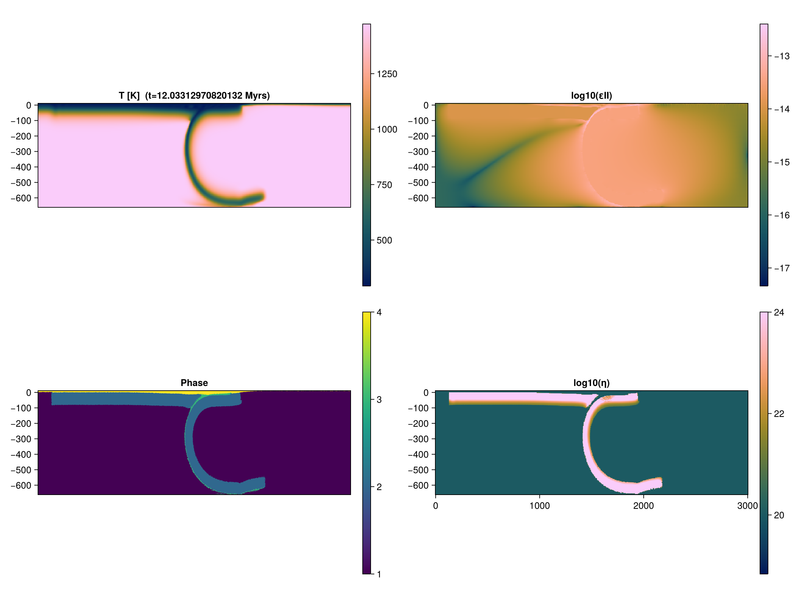

# 2D subduction

Model setups taken from [Hummel et al 2024](https://doi.org/10.5194/se-15-567-2024).

# Initialize packages

Load JustRelax necessary modules and define backend.
```julia
const isCUDA = false

@static if isCUDA
    using CUDA
end

using JustRelax, JustRelax.JustRelax2D, JustRelax.DataIO
using Pkg; Pkg.activate("miniapps")

const backend_JR = @static if isCUDA
    CUDABackend  # Options: CPUBackend, CUDABackend, AMDGPUBackend
else
    JustRelax.CPUBackend
end
```

For this benchmark we will use particles to track the advection of the material phases and their information. For this, we will use [JustPIC.jl](https://github.com/JuliaGeodynamics/JustPIC.jl)
```julia
using JustPIC, JustPIC._2D

const backend_JP = @static if isCUDA
    CUDABackend # Options: JustPIC.CPUBackend, CUDABackend, JustPIC.AMDGPUBackend
else
    JustPIC.CPUBackend
end
```

We will also use [ParallelStencil.jl](https://github.com/omlins/ParallelStencil.jl) to write some device-agnostic helper functions:
```julia
using ParallelStencil, ParallelStencil.FiniteDifferences2D

@static if isCUDA
    @init_parallel_stencil(CUDA, Float64, 2)
else
    @init_parallel_stencil(Threads, Float64, 2)
end
```

and finally the packages used to define the material properties and to plot the results:
```julia
using GeoParams, CairoMakie
```

# Model setup
We will use [GeophysicalModelGenerator.jl](https://github.com/JuliaGeodynamics/GeophysicalModelGenerator.jl) to generate the initial geometry, material phases, and thermal field of our models.


## Model domain
`li` and `origin` are the domain length and lower-left corner returned by the setup routine of the previous section, and `phases_GMG` and `T_GMG` are the corresponding phase and temperature fields.
```julia
nx, ny        = 256, 128         # number of cells in x and y directions (one less than the GMG grid)
ni            = nx, ny
di            = @. li / ni       # grid steps
grid          = Geometry(ni, li; origin = origin)
(; xci, xvi)  = grid # nodes at the center and vertices of the cells
```

## Physical properties using GeoParams
For the rheology we will use the `rheology` object we created in the previous section. We also set an initial time step and the bounds within which the effective viscosity is clamped:
```julia
dt               = 10.0e3 * 3600 * 24 * 365 # 10 kyr
viscosity_cutoff = (1.0e18, 1.0e23)
```

## Initialize particles fields
```julia
nxcell          = 40 # initial number of particles per cell
max_xcell       = 60 # maximum number of particles per cell
min_xcell       = 20 # minimum number of particles per cell
particles       = init_particles(backend_JP, nxcell, max_xcell, min_xcell, grid.xi_vel...)
subgrid_arrays  = SubgridDiffusionCellArrays(particles; loc = :center)
```

`loc = :center` because the resolved temperature field of `ThermalArrays` lives at the cell centers.

We would like to advect two fields stored at the particles, the temperature `pT`, and the material phases of each particle `pPhases`, which we initialize as `CellArray` objects:
```julia
pPhases, pT      = init_cell_arrays(particles, Val(2))
particle_args    = (pT, pPhases)
```

## Assign particles phases
`phases_GMG` is defined on the grid vertices, so each particle takes the phase of the nearest vertex of its cell:
```julia
function init_phases!(phases, phase_grid, particles, xvi)
    ni = size(phases)
    @parallel (@idx ni) _init_phases!(phases, phase_grid, particles.coords, particles.index, xvi)
end

@parallel_indices (I...) function _init_phases!(phases, phase_grid, pcoords::NTuple{N, T}, index, xvi) where {N, T}
    ni = size(phases)

    for ip in cellaxes(phases)
        # quick escape
        @index(index[ip, I...]) == 0 && continue

        pᵢ = ntuple(Val(N)) do i
            @index pcoords[i][ip, I...]
        end

        d = Inf # distance to the nearest vertex
        particle_phase = -1
        for offi in 0:1, offj in 0:1
            ii, jj = I[1] + offi, I[2] + offj
            !(ii ≤ ni[1]) && continue
            !(jj ≤ ni[2]) && continue

            xvᵢ = (xvi[1][ii], xvi[2][jj])
            d_ijk = √(sum((pᵢ[i] - xvᵢ[i])^2 for i in 1:N))
            if d_ijk < d
                d = d_ijk
                particle_phase = phase_grid[ii, jj]
            end
        end
        @index phases[ip, I...] = Float64(particle_phase)
    end

    return nothing
end
```

Now we assign the material phases from the arrays we computed with help of [GeophysicalModelGenerator.jl](https://github.com/JuliaGeodynamics/GeophysicalModelGenerator.jl)
```julia
phases_device    = PTArray(backend_JR)(phases_GMG)
phase_ratios     = PhaseRatios(backend_JP, length(rheology), ni);
init_phases!(pPhases, phases_device, particles, xvi)
update_phase_ratios!(phase_ratios, particles, pPhases)
```

## Define temperature profile
We need to copy the thermal field from the [GeophysicalModelGenerator.jl](https://github.com/JuliaGeodynamics/GeophysicalModelGenerator.jl) object to `thermal`, which contains the arrays related to the thermal field.
```julia
Ttop             = 20 + 273
Tbot             = maximum(T_GMG)
thermal          = ThermalArrays(backend_JR, ni)
vertex2center!(thermal.T, PTArray(backend_JR)(T_GMG); ghost_x = true, ghost_y = true)
thermal_bc       = TemperatureBoundaryConditions(;
    no_flux      = (left = true, right = true, top = false, bot = false),
    constant_value = (left = false, right = false, top = Ttop, bot = Tbot),
)
thermal_bcs!(thermal, thermal_bc)
```

## Instantiate Stokes arrays
Stokes arrays object
```julia
stokes           = StokesArrays(backend_JR, ni)
pt_stokes        = PTStokesCoeffs(li, di; ϵ_abs = 1e-4, ϵ_rel = 1e-4, Re = 1e0, r = 0.7, CFL = 0.9 / √2.1)
```

## Initialize buoyancy forces and lithostatic pressure
```julia
ρg        = ntuple(_ -> @zeros(ni...), Val(2))
compute_ρg!(ρg[2], phase_ratios, rheology, (T = thermal.T, P = stokes.P))
compute_lithostatic_pressure!(stokes.P, ρg[2], di[2], igg)
```

## Initialize viscosity
```julia
args = (T = thermal.T, P = stokes.P, dt = Inf)
compute_viscosity!(stokes, phase_ratios, args, rheology, viscosity_cutoff)
```

## Define boundary conditions
We we will use free slip boundary conditions on all sides
```julia
# Boundary conditions
flow_bcs         = VelocityBoundaryConditions(;
    free_slip    = (left = true , right = true , top = true , bot = true ),
    no_slip      = (left = false, right = false, top = false, bot = false),
)
flow_bcs!(stokes, flow_bcs) # apply boundary conditions
update_halo!(@velocity(stokes)...)
```

## Pseuo-transient coefficients
```julia
pt_thermal = PTThermalCoeffs(
    backend_JR, rheology, phase_ratios, args, dt, ni, di, li; ϵ = 1e-8, CFL = 0.95 / √2
)
```

## Just before solving the problem...
`thermal.T` is a cell-centered field surrounded by one ring of ghost nodes, which [JustPIC.jl](https://github.com/JuliaGeodynamics/JustPIC.jl) does not handle. We therefore keep a ghost-free buffer of the cell-centered temperature and use it for every exchange with the particles.
```julia
T_buffer = thermal.T[2:end-1, 2:end-1]
dt₀      = similar(stokes.P)
centroid2particle!(pT, T_buffer, particles)
```

# Solving the problem
We will now advance the model in time, solving the Stokes and thermal equations, and advecting the particles.

## Advancing one time step

1. Interpolate the temperature from the particles back to the cell centers
```julia
particle2centroid!(T_buffer, pT, particles)
@views thermal.T[2:end-1, 2:end-1] .= T_buffer
thermal_bcs!(thermal, thermal_bc)
```
2. Solve stokes
```julia
 t_stokes = @elapsed begin
    out = solve!(
        stokes,
        pt_stokes,
        grid,
        flow_bcs,
        ρg,
        phase_ratios,
        rheology,
        args,
        dt,
        igg;
        kwargs = (
            iterMax          = 100e3,
            nout             = 2e3,
            viscosity_cutoff = viscosity_cutoff,
            free_surface     = false,
            viscosity_relaxation = 1e-2
        )
    );
end
println("Stokes solver time             ")
println("   Total time:      $t_stokes s")
println("   Time/iteration:  $(t_stokes / out.iter) s")
tensor_invariant!(stokes.ε)
```
3. Update time step
```julia
dt = compute_dt(stokes, di) * 0.8
```

4. Thermal solver and subgrid diffusion
```julia
heatdiffusion_PT!(
    thermal,
    pt_thermal,
    thermal_bc,
    rheology,
    args,
    dt,
    grid;
    kwargs = (
        igg     = igg,
        phase   = phase_ratios,
        iterMax = 50e3,
        nout    = 1e2,
        verbose = true,
    )
)
# Subgrid diffusion
subgrid_characteristic_time!(
    subgrid_arrays, particles, dt₀, phase_ratios, rheology, thermal, stokes
)
centroid2particle!(subgrid_arrays.dt₀, dt₀, particles)
subgrid_diffusion_centroid!(
    pT, T_buffer, thermal.ΔT, subgrid_arrays, particles, dt
)
```

5. Particles advection
```julia
# advect particles in space
advection_MQS!(particles, RungeKutta2(), @velocity(stokes), dt)
# advect particles in memory
move_particles!(particles, particle_args)
# check if we need to inject particles
inject_particles_phase!(particles, pPhases, (pT, ), (T_buffer, ))
# update phase ratios
update_phase_ratios!(phase_ratios, particles, pPhases)
```

6. **Optional:** Save checkpoint every 10 time steps
Saving the particles will generate a lot of data so you might want to do this less frequently depending on your model size.
```julia
if rem(it, 10) == 0
    checkpoint = joinpath(figdir, "checkpoint")
    take(checkpoint)
    checkpointing_jld2(checkpoint, stokes, thermal, t, dt; it = it)
    checkpointing_particles(checkpoint, particles; phases = pPhases, phase_ratios = phase_ratios, particle_args = particle_args, t = t, dt = dt, it = it)
end
```

7. **Optional:** Save data as VTK to visualize it later with [ParaView](https://www.paraview.org/)
```julia
Vx_v = @zeros(ni.+1...)
Vy_v = @zeros(ni.+1...)
velocity2vertex!(Vx_v, Vy_v, @velocity(stokes)...) # interpolate velocity from staggered grid to vertices
data_v = (; # data @ vertices
    Vx  = Array(Vx_v),
    Vy  = Array(Vy_v),
)
data_c = (; # data @ centers
    T   = Array(T_buffer),
    P   = Array(stokes.P),
    τII = Array(stokes.τ.II),
    εII = Array(stokes.ε.II),
    η   = Array(stokes.viscosity.η_vep),
)
velocity_v = ( # velocity vector field
    Array(Vx_v),
    Array(Vy_v),
)
save_vtk(
    joinpath(@__DIR__, "vtk_" * lpad("$it", 6, "0")),
    xvi,
    xci,
    data_v,
    data_c,
    velocity_v,
    t=t
)
```

### Final model
Solution after 990 time steps

