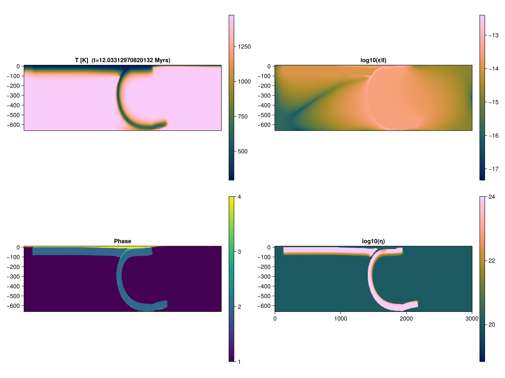

# 2D subduction

Model setups taken from [Hummel et al 2024](https://doi.org/10.5194/se-15-567-2024).

# Model setup
We will use [GeophysicalModelGenerator.jl](https://github.com/JuliaGeodynamics/GeophysicalModelGenerator.jl) to generate the initial geometry, material phases, and thermal field of our models.


# Initialize packages

Load JustRelax necessary modules and define backend.
```julia
using CUDA # comment this out if you are not using CUDA; or load AMDGPU.jl if you are using an AMD GPU
using JustRelax, JustRelax.JustRelax2D, JustRelax.DataIO
const backend_JR = CUDABackend  # Options: CPUBackend, CUDABackend, AMDGPUBackend
```

For this benchmark we will use particles to track the advection of the material phases and their information. For this, we will use [JustPIC.jl](https://github.com/JuliaGeodynamics/JustPIC.jl)
```julia
using JustPIC, JustPIC._2D
const backend = CUDABackend # Options: JustPIC.CPUBackend, CUDABackend, JustPIC.AMDGPUBackend
```

We will also use [ParallelStencil.jl](https://github.com/omlins/ParallelStencil.jl) to write some device-agnostic helper functions:
```julia
using ParallelStencil
@init_parallel_stencil(CUDA, Float64, 2)
```
### Helper function
We first define a helper function that will be useful later on

```julia
function copyinn_x!(A, B)
    @parallel function f_x(A, B)
        @all(A) = @inn_x(B)
        return nothing
    end

    @parallel f_x(A, B)
end
```

# Script

## Model domain
```julia
nx, ny        = 256, 128         # number of cells in x and y directions
ni            = nx, ny
di            = @. li / ni       # grid steps
grid          = Geometry(ni, li; origin = origin)
(; xci, xvi)  = grid # nodes at the center and vertices of the cells
```

## Physical properties using GeoParams
For the rheology we will use the `rheology` object we created in the previous section.

## Initialize particles
```julia
nxcell              = 40 # initial number of particles per cell
max_xcell           = 60 # maximum number of particles per cell
min_xcell           = 20 # minimum number of particles per cell
    particles = init_particles(
        backend, nxcell, max_xcell, min_xcell, xvi...
    )
)
subgrid_arrays      = SubgridDiffusionCellArrays(particles)
# velocity staggered grids
grid_vxi            = velocity_grids(xci, xvi, di)
```

We will like to advect two fields, the temperature `pT` and the material phases of each particle `pPhases`. We will initialize these fields as `CellArray` objects:
```julia
pPhases, pT         = init_cell_arrays(particles, Val(2))
particle_args       = (pT, pPhases)
```

# Assign particles phases anomaly
Now we assign the material phases from the arrays we computed with help of [GeophysicalModelGenerator.jl](https://github.com/JuliaGeodynamics/GeophysicalModelGenerator.jl)
```julia
phases_device    = PTArray(backend)(phases_GMG)
phase_ratios     = PhaseRatio(backend, ni, length(rheology))
init_phases!(pPhases, phases_device, particles, xvi)
phase_ratios_center!(phase_ratios, particles, grid, pPhases)
```

## Temperature profile
We need to copy the thermal field from the [GeophysicalModelGenerator.jl](https://github.com/JuliaGeodynamics/GeophysicalModelGenerator.jl) object to the `thermal` that contains all the arrays related to the thermal field.
```julia
Ttop             = 20 + 273
Tbot             = maximum(T_GMG)
thermal          = ThermalArrays(backend, ni)
@views thermal.T[2:end-1, :] .= PTArray(backend)(T_GMG)
thermal_bc       = TemperatureBoundaryConditions(;
    no_flux      = (left = true, right = true, top = false, bot = false),
)
thermal_bcs!(thermal, thermal_bc)
@views thermal.T[:, end] .= Ttop
@views thermal.T[:, 1]   .= Tbot
temperature2center!(thermal)
```

## Stokes arrays
Stokes arrays object
```julia
stokes           = StokesArrays(backend, ni)
pt_stokes        = PTStokesCoeffs(li, di; ϵ=1e-4, Re=3π, r=1e0, CFL = 1 / √2.1) # Re=3π, r=0.7
```

## Buoyancy forces and lithostatic pressure
```julia
ρg        = ntuple(_ -> @zeros(ni...), Val(2))
compute_ρg!(ρg[2], phase_ratios, rheology_augmented, (T=thermal.Tc, P=stokes.P))
stokes.P .= PTArray(backend)(reverse(cumsum(reverse((ρg[2]).* di[2], dims=2), dims=2), dims=2))
```

## Viscosity
```julia
args0            = (T=thermal.Tc, P=stokes.P, dt = Inf)
viscosity_cutoff = (1e17, 1e24)
compute_viscosity!(stokes, phase_ratios, args0, rheology, viscosity_cutoff)
```

## Boundary conditions
We we will use free slip boundary conditions on all sides
```julia
# Boundary conditions
flow_bcs         = VelocityBoundaryConditions(;
    free_slip    = (left = true , right = true , top = true , bot = true),
)
```

## Pseuo-transient coefficients
```julia
pt_thermal = PTThermalCoeffs(
    backend, rheology_augmented, phase_ratios, args0, dt, ni, di, li; ϵ=1e-5, CFL=1e-3 / √3
)
```

## Just before solving the problem...
Because we have ghost nodes on the thermal field `thermal.T`, we need to copy the thermal field to a buffer array without those ghost nodes, and interpolate the temperature to the particles. This is because [JustPIC.jl](https://github.com/JuliaGeodynamics/JustPIC.jl) does not support ghost nodes yet.
```julia
T_buffer    = @zeros(ni.+1)
Told_buffer = similar(T_buffer)
dt₀         = similar(stokes.P)
for (dst, src) in zip((T_buffer, Told_buffer), (thermal.T, thermal.Told))
    copyinn_x!(dst, src)
end
grid2particle!(pT, xvi, T_buffer, particles)
```

## Advancing one time step

1. Interpolate fields from particle to grid vertices
```julia
particle2grid!(T_buffer, pT, xvi, particles)
@views T_buffer[:, end]      .= Ttop
@views T_buffer[:, 1]        .= Tbot
@views thermal.T[2:end-1, :] .= T_buffer
thermal_bcs!(thermal, thermal_bc)
temperature2center!(thermal)
```
2. Solve stokes
```julia
 t_stokes = @elapsed begin
    out = solve!(
        stokes,
        pt_stokes,
        di,
        flow_bcs,
        ρg,
        phase_ratios,
        rheology_augmented,
        args,
        dt,
        igg;
        kwargs = (
            iterMax          = 150e3,
            nout             = 1e3,
            viscosity_cutoff = viscosity_cutoff,
            free_surface     = false,
            viscosity_relaxation = 1e-2
        )
    );
end
println("Stokes solver time             ")
println("   Total time:      $t_stokes s")
println("   Time/iteration:  $(t_stokes / out.iter) s")
```
3. Update time step
```julia
dt = compute_dt(stokes, di) * 0.8
```

4. Thermal solver and subgrid diffusion
```julia
heatdiffusion_PT!(
    thermal,
    pt_thermal,
    thermal_bc,
    rheology_augmented,
    args,
    dt,
    di;
    kwargs = (
        igg     = igg,
        phase   = phase_ratios,
        iterMax = 50e3,
        nout    = 1e2,
        verbose = true,
    )
)
subgrid_characteristic_time!(
    subgrid_arrays, particles, dt₀, phase_ratios, rheology_augmented, thermal, stokes, xci, di
)
centroid2particle!(subgrid_arrays.dt₀, xci, dt₀, particles)
subgrid_diffusion!(
    pT, thermal.T, thermal.ΔT, subgrid_arrays, particles, xvi,  di, dt
)
```

5. Particles advection
```julia
# advect particles in space
advection!(particles, RungeKutta2(), @velocity(stokes), grid_vxi, dt)
# advect particles in memory
move_particles!(particles, xvi, particle_args)
# check if we need to inject particles
inject_particles_phase!(particles, pPhases, (pT, ), (T_buffer, ), xvi)
# update phase ratios
phase_ratios_center!(phase_ratios, particles, grid, pPhases)
```

6. **Optional:** Save data as VTK to visualize it later with [ParaView](https://www.paraview.org/)
```julia
Vx_v = @zeros(ni.+1...)
Vy_v = @zeros(ni.+1...)
velocity2vertex!(Vx_v, Vy_v, @velocity(stokes)...) # interpolate velocity from staggered grid to vertices
data_v = (; # data @ vertices
    T   = Array(T_buffer),
    τII = Array(stokes.τ.II),
    εII = Array(stokes.ε.II),
    Vx  = Array(Vx_v),
    Vy  = Array(Vy_v),
)
data_c = (; # data @ centers
    P   = Array(stokes.P),
    η   = Array(stokes.viscosity.η_vep),
)
velocity_v = ( # velocity vector field
    Array(Vx_v),
    Array(Vy_v),
)
save_vtk(
    joinpath(@__DIR__, "vtk_" * lpad("$it", 6, "0")),
    xvi,
    xci,
    data_v,
    data_c,
    velocity_v
)
```

### Final model
Solution after 990 time steps

