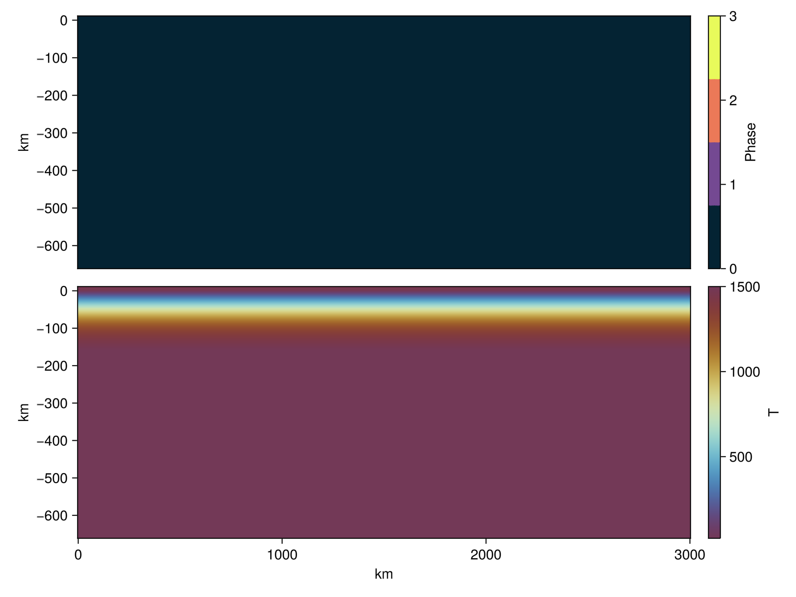
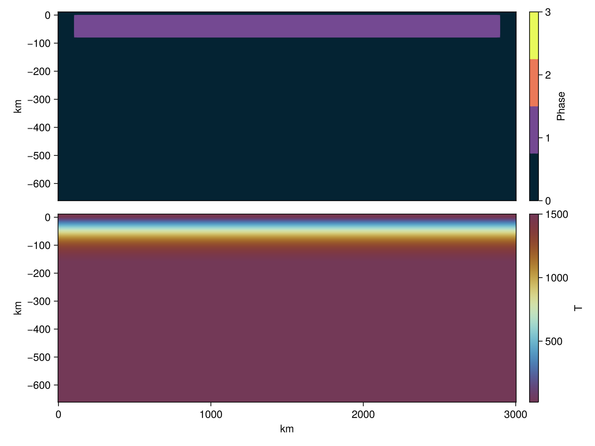
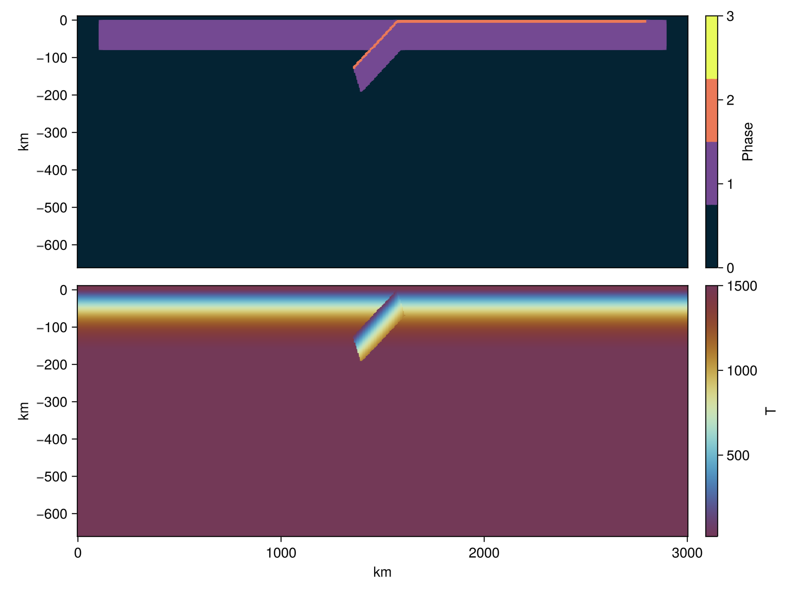

# Model setup
As described in the original [paper](https://doi.org/10.5194/se-15-567-2024), the domain consists of a Cartesian box of $\Omega \in [0, 3000] \times [0, -660]$ km, with two 80km thick oceanic plates over the asthenospheric mantle. 

We will use GeophysicalModelGenerator.jl to generate the initial geometry, material phases, and thermal field of our models. We will start by defining the dimensions and resolution of our model, as well as initializing the `Grid2D` object and two arrays `Phases` and `Temp` that host the material phase (given by an integer) and the thermal field, respectively.

```julia
nx, nz        = 512, 218 # number of cells per dimension
Tbot          = 1474.0   # [Celsius]
model_depth   = 660      # [km]
air_thickness = 10       # [km]
Lx            = 3000     # model length [km]
x             = range(0, Lx, nx);
z             = range(-model_depth, air_thickness, nz);
Grid2D        = CartData(xyz_grid(x,0,z))
Phases        = zeros(Int64, nx, 1, nz);
Temp          = fill(Tbot, nx, 1, nz);
```

In this model we have four material phases with their respective phase numbers: 

| Material            | Phase number |
| :----------------   | :----------: |
| asthenosphere       |       0      |
| oceanic lithosphere |       1      |
| oceanic crust       |       3      |
| sticky air          |       4      |

We will start by initializing the model as asthenospheric mantle, with a thermal profile given by the half-space cooling model with an age of 80 Myrs.

```julia
add_box!(
    Phases, 
    Temp, 
    Grid2D; 
    xlim    = (0, Lx),
    zlim    = (-model_depth, 0.0), 
    phase   = LithosphericPhases(Layers=[], Phases=[0]), 
    T       = HalfspaceCoolingTemp(Tsurface=20, Tmantle=Tbot, Age=80,Adiabat=0.4)
)
```


Next we add a horizontal 80km thick oceanic lithosphere. Note that we leave a 100km buffer zone next to the vertical boundaries of the domain, to facilitate the sliding of the oceanic plates.
```julia
add_box!(
    Phases, 
    Temp, 
    Grid2D; 
    xlim    = (100, Lx-100), # 100 km buffer zones on both sides
    zlim    = (-model_depth, 0.0),
    phase   = LithosphericPhases(Layers=[80], Phases=[1 0]), 
    T       = HalfspaceCoolingTemp(Tsurface=20, Tmantle=Tbot, Age=80, Adiabat=0.4)
)
```


As in the original paper, we add a 8km thick crust on top of the subducting oceanic plate.
```julia
# Add right oceanic plate crust
add_box!(
    Phases, 
    Temp, 
    Grid2D; 
    xlim    = (Lx-1430, Lx-200), 
    zlim    = (-model_depth, 0.0), 
    Origin  = nothing, StrikeAngle=0, DipAngle=0,
    phase   = LithosphericPhases(Layers=[8 72], Phases=[2 1 0]), 
    T       = HalfspaceCoolingTemp(Tsurface=20, Tmantle=Tbot, Age=80, Adiabat=0.4)
)
```


And finally we add the subducting slab, with the trench located at 1430km from the right-hand-side boundary.

```julia
add_box!(
    Phases, 
    Temp, 
    Grid2D; 
    xlim    = (Lx-1430, Lx-1430-250), 
    zlim    = (-80, 0.0), 
    Origin  = (nothing, StrikeAngle=0, DipAngle=-30),
    phase   = LithosphericPhases(Layers=[8 72], Phases=[2 1 0]), 
    T       = HalfspaceCoolingTemp(Tsurface=20, Tmantle=Tbot, Age=80, Adiabat=0.4)
)
```


```julia
surf = Grid2D.z.val .> 0.0 
@views Temp[surf] .= 20.0
@views Phases[surf] .= 3
```


```julia
li     = (abs(last(x)-first(x)), abs(last(z)-first(z))) .* 1e3 # in meters
origin = (x[1], z[1]) .* 1e3 # lower-left corner of the domain
Phases = Phases[:,1,:] .+ 1  # +1 because Julia is 1-indexed
Temp   = Temp[:,1,:].+273    # in Kelvin
``` 